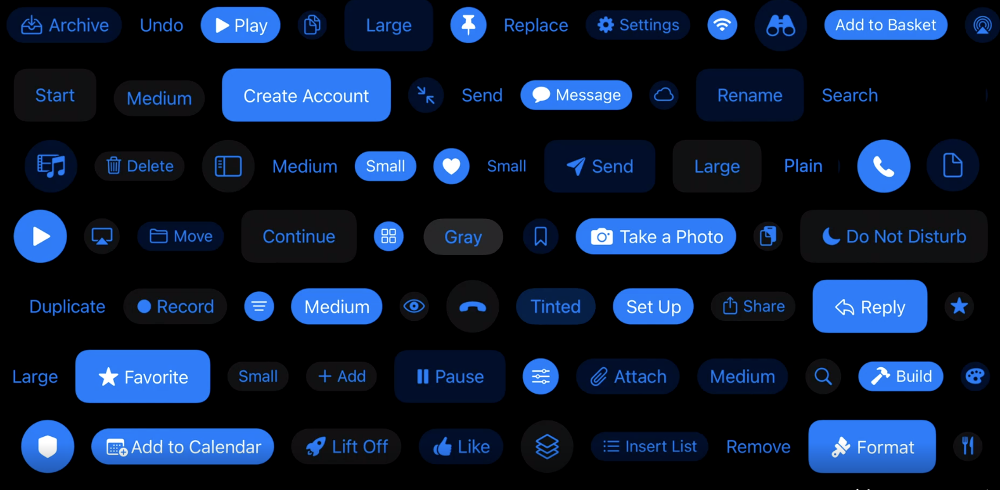

[WWDC 2021 UIKit Button System](https://developer.apple.com/videos/play/wwdc2021/10064/)


### iOS 15에서 제공하는 버튼의 4가지 스타일

* Plain

* Gray

* Tinted

* Filled 


### 버튼의 추가적인 다른 특징들 

* Dynamic Type

* Multiline


* Accessibility

* Easier Customization 


### UIButton Configuration

```
let button = UIButton(type: .system)  
button.configuration = .filled()
button.setTitle("Button Text", for: [])

```


```
var config = UIButton.Configuration.tinted()
config.title = "Button Title"
config.image = UIImage(systemName: "cart")
config.imagePlacement = .trailing
addToCartButton = UIButton(configuration: config, primaryAction: ...)
```

```
addToCartButton.configurationUpdateHandler = {
  [unowned self] button in 
  var config = button.configuration
  config?.image = button.isHighlighted
      ? UIImage(systemName: "cart.fill.badge.plus")
      : UIImage(systemName: "cart.badge.plus")
  config?.subtitle = self.itemQuantityDescription
  button.configuration = config
}
```

```
private var itemQuantityDescription: String ? {
  didSet {
    addToCartButton.setNeedsUpdateConfiguration()
  }
}
```

###
Activity Indicator 

```
showActivityIndicator = true
```

### Metrics Adjustments


### Toggle Buttons
UIControl에서 선택된(selected) 상태를 유지하며 버튼을 누를 때마다 자동으로 토글됩니다. 캘린더의 UIBarButtonItem에서도 작동하며, 예 들어 단 표시줄에서 요일 세부 정보를 활성, 비활성화 수 있습니다. 토글버튼을 눌러서 세부 정보 표시를 껐다 킬 수 있습니다.

```
let stockToggleAction = UIAction(title: "In Stock only" ) {_ in 
    toggleStock()
}

let button = UIButton(primaryAction: stockToggleAction)

// initial state
button.changeSelectionAsPrimaryAction = true
```


### Pop-up Buttons


### Pull-down Buttons


### UIMenu
---


