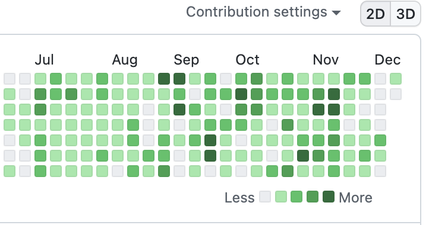

# 0. 제 소개

저는 일러스트레이터와 디자이너로 일을 하다가 2022년, 올해 2월부터 iOS 공부를 시작해서 현재는 연극과 뮤지컬 후기를 쓰는 ‘연뮤로그’와 주둔군과 한국군인을 위한 약어 및 용어 검색사전 ‘한미연합사전’, 이렇게 2개의 앱을 출시하였습니다. 

아직 열심히 공부해가는 입장이지만 주변의 학우들과 지인들이 앱 출시까지 어떻게 iOS 공부를 했는지를 많이 궁금해해서 이렇게 글을 쓰게 되었습니다. 

## 개발공부 타임라인

저는 올해 2월까지는 풀타임 디자이너로 근무를 하고, 3월부터 6월까지는 학교수업 (12학점)과 병행하고, 이후에는 휴학하고 iOS 개발 공부에 전념했습니다. 

# 1. iOS 개발을 시작한 계기

 이전에 파이썬과 장고와 리액트와 플러터와 머신러닝과 안드로이드 공부를 찍먹하면서 제 손에 맞지 않는다는 느낌을 계속 받았습니다. HCI에 관심을 가졌다가 인공지능에 매료되어 다시 대학교 CS 전공으로 들어갔는데 팬데믹 시기와 맞물려서 갑작스레 변화한 교육환경에, 처음 듣는 전통적인 CS 과목을 공부하는 것이 쉽지 않았습니다. 

20년도 하반기부터 일을 병행하고 21년도에도 휴학하고 커리어 고민을 이어가던 찰나에, 이상하게도 21년도 그 해에는 모바일 앱 회사에서 UI/UX 디자인 일을 자꾸만 하게 되었습니다. 앱 디자인을 하다보면 타사 앱을 참고용으로 다운받아 많이 사용하게 되는데, ‘나도 이런 앱을 만들고 싶다’는 마음이 자꾸만 들었습니다. 그렇게 자연스레  iOS 개발 공부를 마음먹게 되었습니다. 

처음에 정말 너무 아무것도 몰라서 iOS 강의를 열심히 검색해봤었는데 주로 Swift 문법을 자세히 알려주는 강의들이 많았습니다. 근데 저는 영어 공부할 때도 문법을 정말 너무 싫어하던 사람이었거든요. 예전에 C 언어 수업을 들었다가 포인터에서 포기했던 기억이 있었는데요. 

###### 문법부터 보면 정말 눈에 안 보여요...

Swift 언어를 하나도 몰랐지만 문법부터 공부하면 질려버릴 것 같아서 최대한 실습을 하는 강의를 위주로 찾아보게 되었습니다.

# 2. 첫 두달은 패스트캠퍼스 iOS 강의를 보면서 일단 코드를 따라치기

###### 처음엔 그냥 냅다 따라쳤습니다.

저는 패스트 캠퍼스에서 iOS 앱개발 올인원 패키지를 들었는데 지금은 내려가고 업데이트 된 버전으로 아래처럼 올라왔습니다. 저는 다행히 2020년 12월에 결제 내역이 있었어요. 일하던 회사의 앱 리뉴얼 디자인을 하면서 참고 겸 구매했던 것 같은데 개발자가 되고자 마음먹고 강의를 보니 느낌이 새로웠습니다. 

[왕초보를 위한 한 번에 끝내는 iOS 앱 개발 바이블 초격차 패키지 Online. | 패스트캠퍼스](https://fastcampus.co.kr/dev_online_iosbible)

전 네이버, 현 알라미 개발자인 이준원 개발자님이 알려주시는데 하나하나 프로젝트를 따라해보면서 할 수 있어서 좋았습니다. 바로 처음부터 언어, 문법 위주로 안 나가고 프로젝트 위주로 직접 돌려볼 수 있어서 재밌었어요. 

이 때는 실습 뿐 아니라 말씀해주신 내용도 기본 Notes 앱으로  열심히 받아적고 공부했습니다. 구 버전 강의 기준으로 약 80% 정도는 수강했고 수강한 내용 중 대부분을 아래처럼 공부노트를 만들었어요.

###### 22년도 1월 31일부터 4월 초까지 공부 노트

이 때는 못 알아들어도 그냥 했습니다. 맨 처음 시작하는 입장에서는 시뮬레이터에서 앱이 구동하는 걸 보는 게 엄청 뿌듯하더라고요. 게다가 iOS 시뮬레이터는 예뻐서 더 볼 맛이 났어요. 

거의 무지성으로 따라쳤지만 그래도 정량적인 학습이 정성적으로 머리에 쌓이는 걸 느끼게 됐습니다. 디자인 패턴 등 자세하게 알려주시지만 여전히 콜렉션뷰와 테이블뷰로 낑낑댔습니다. 

###### 이 정도면 MVC아니고 VC...

그러다보니 모델을 분리하고 좋은 아키텍처를 짠다기보다는, 당장 눈 앞의 뷰컨트롤러에서 크게 벗어나지 못했습니다. 

이때부터는 좀 더 Swift 언어나 iOS  전반에 대해 더 잘 알고 싶어진다는 생각이 들었습니다. 강의를 들으면서 가볍게 넘어갔던 내용들 뒤에 있는 수많은 배경지식이 궁금했고요. UIKit을 이용해 기본적인 디자인의 앱을 만들어봤지만, 실제 내가 쓰고 있는 예쁘고 매력적인 앱들을 만드려면 어떻게 만들어야하지? 라는 생각이 들었습니다. 아직도 기본 베이스가 없다는 인지가 들어서 다른 강의와 공부자료를 찾아보게 되었습니다. 

# 3. 다른 강의, 도큐먼트를 이제야 찾아봄

### 유명한 하버드 강의와 스탠포드 강의 겉핥기

**하버드 cs50 - ios 강의(무료) + 한글자막 X**

[CS50 2019 - iOS Track](https://www.youtube.com/playlist?list=PLhQjrBD2T3810ZX79Xrgj8X382QaWbk_J)

**스탠포드 강의 (무료) + 한글자막 O** 

\[[스탠포드]Swift를 활용한 iOS11 앱 개발 강좌소개 : edwith](http://www.edwith.org/swiftapp)

스탠포드 강의에 다루는 내용은 패캠에서 본 내용과 겹치는 내용들이 있어서 cs50의 iOS 트랙 위주로 가볍게 스키밍하듯 보았습니다. 아는 내용이라면 스킵하고 모르는 내용이더라도 공부노트를 따로 만들지는 않고 듣기만 했습니다. 만약 영어자막에 거부감이 없다면 패캠보다는 ***CS50으로 먼저 iOS 개발공부를 시작해도 좋을 것 같습니다.*** 

어떤 걸 클릭하는지 화면을 크게 보여주고, 어떤 개념인지 굉장히 꼼꼼하게 알려줍니다. 특히 완전 처음 시작할 때는 Xcode 버튼 하나하나 잘못 누를까봐 벌벌 떨면서 클릭하곤 했는데 그런 걱정을 알아챘는지 크게크게 화면에서 보여주고요. 4K라 화질이 좋기 때문에 굉장히 따라가기 쉽습니다. 

그리고 패스트캠퍼스 동영상 플레이어보다는 유튜브 플레이어가 지원하는 기능이 더 많았기 때문에 미묘하게 신경쓰이는 아주 작은 옵스타클을 없애고 공부의 흐름을 수월하게 할 수 있었습니다. 일례로 저는 위처럼 버튼 잘못 누를까봐 맥북의 트랙패드를 이용해 화면을 확대해서 강의를 보곤 했는데요. 패스트캠퍼스에서는 트랙패드 제스처를 하면 볼륨이 조절되는 불편함이 있습니다. 일반적인 UX가 아니어서 더 불편했어요. 

처음 공부할 때는 조금이라도 장애물이 생기면 쉽게 좌절하거나 포기하게 되므로 흐름을 매끄럽게 만들 수 있는 공부방법을 선택하는 게 제일 좋은 것 같습니다. 

## 📄 스위프트 공식문서와 📕 꼼꼼한 재은씨 문법편 읽기

**Swift 공식문서**

[The Basics - The Swift Programming Language (Swift 5.7)](https://docs.swift.org/swift-book/LanguageGuide/TheBasics.html)

꼼꼼한 재은씨 문법편

책도 사고 공식문서도 조금씩 봤습니다. 꼼꼼한 재은씨 책의 경우 말하듯이 술술 읽히는 편이라서 읽기는 좋았지만 책이 두께가 있고 이북을 지원하지 않습니다. 저는 종이책의 물성이 좋아서 처음에는 재은씨를 좀 읽다가, 공식문서가 이북을 지원하길래 공식문서 위주로 읽게 되었습니다.

이렇게 책갈피나 하이라이트도 좋구요. 

반면 공식문서쪽은 도서 앱으로 이북을 읽을 수 있어서 이동중에 휴대폰이나 아이패드로 읽기 간편합니다. 책갈피나 하이라이트 기능도 굉장히 좋고요.

예를 들면, ‘아 오늘 Alamofire 라이브러리 썼는데 response의 statusCode를 ? 로 접근하네. 이게 뭐지. 이게 [옵셔널 체이닝](https://docs.swift.org/swift-book/LanguageGuide/OptionalChaining.html)인가’라는 식으로 그때 그때 개발공부하면서 필요하거나 생각나는 키워드를 찾아 읽었습니다. 

처음부터 읽으려고 하게 되면 ‘수학의 정석’에서 집합만 주구장창 읽는 사람처럼 앞 부분에서 못 헤어날 것 같기도 했고요. 모바일 이북 기준으로는 950페이지인데 하루에 10페이지씩 읽어도 꼬박 3개월 내내 읽어야 되는데 자신이 없기도 했고요.

# 4. 개인 프로젝트 하기

## 꽁냥: 3월 중반부터 6월까지 학교 프로젝트

22년 3월 중순에 학교에서 진행하는 자기주도진로프로젝트로 iOS 앱 개발을 하게 되었습니다. 

자세한 내용은 여기에 자세히 확인할 수 있습니다.  

[학교 프로젝트로 시작한 iOS 앱 꽁냥 만드는 이야기 - 1](https://kimdee.netlify.app/blog/%ED%95%99%EA%B5%90-%ED%94%84%EB%A1%9C%EC%A0%9D%ED%8A%B8%EB%A1%9C-%EC%8B%9C%EC%9E%91%ED%95%9C-ios-%EC%95%B1-%EA%BD%81%EB%83%A5-%EB%A7%8C%EB%93%9C%EB%8A%94-%EC%9D%B4%EC%95%BC%EA%B8%B0-1-1/)

기획과 디자인, iOS 개발 공부, 학교를 복학했다보니 전공공부까지 쉴틈없이 한 학기를 병행해 나갔습니다. 

이 모든 과정을 약 3개월간 진행했는데요.  이 때, 정말 많이 힘들었지만 하나하나 완성해갈때마다 신기하고 재밌습니다.

[https://kimdee.notion.site/iOS-2977c7cc689e45cfa391c9d92b7b2e57](https://www.notion.so/iOS-2977c7cc689e45cfa391c9d92b7b2e57)

위에서 당시 개발 현황 및 프로젝트 보고서를 확인할 수 있습니다. 

꽁냥은 `Storyboard`로 UI를 만들고 `Firebase`의 `Realtime Database`와 `Auth`를 이용해 만든 앱이었는데요. 

이 앱을 만들면서 제일 힘들었던 부분은, 파이어베이스와 통신하는 부분과 화면에서 업데이트 되는 부분이 순차적으로 이루어지지 않아서, 요청 버튼을 누르고 다른 탭으로 가서 화면 갱신을 하거나, 콜렉션뷰에 설정해둔 `refresh control`을 이용해 제스쳐를 통해서 데이터를 리로드해오는 등… UX적으로 굉장히 불편했습니다.

UI가 업데이트 되는 동안 그 뒷편에서 네트워크 통신이 일어난다는 건 알았지만 이걸 어떤 식으로 해결해야되는지, 뭘로 검색해야 되는지에 대해서조차도 몰랐습니다. 이 때 참으로 속상하더라고요.

이런 아쉬움에 Swift 알고리즘 스터디를 온라인으로 하게 되었는데요. 그 때 알게 된 지인을 통해 새싹 iOS 부트캠프를 추천받고 지원하게 되었습니다. 

# 6. 부트캠프 참여

## 7월부터 12월까지 새싹 iOS 메모리스 2기

얼마전에 수료식을 마쳤습니다. 수료식을 다녀오고 얼마나 벅찼는지 몰라요. 

<iframe border=0 frameborder=0 height=750 width=550
 src="https://twitframe.com/show?url=https://twitter.com/kimdee_dev/status/1601724482712145920?s=12&t=hNvungTNXIrWLgyEBmf93A"></iframe>

혼자 공부하면서 가장 힘들었던 건, 뭘 모르는지조차 모른다는 점이었습니다. 

새싹 과정에서는 iOS 개발자로서의 로드맵을 하나하나 차근차근 제대로 밟아갈 수 있도록 지도해주시고, 제대로 학습할 수 있는 여러가지 여건을 만들어주셔서 고민없이 행복하게 iOS 개발공부를 할 수 있었습니다.

### 부트캠프 기간 공부 방법

이 때는 `Notion`을 이용해서 학습노트를 만들고, 공부한 내용의 키워드를 추출해서 태그로 만들어 이후에도 복습을 편하게 할 수 있도록 만들었습니다.  

푸시를 깜박할 때도 많았지만, 공부한 프로젝트 중 일부는 깃허브로 이렇게 올렸습니다. 공부한 내용을 보면서 멘토님들이 코드리뷰를 해주시기도 하고… 정말 너무 좋았어요! 

교육과정에 대한 좀 더 자세한 후기는 12월 중으로 올리도록 하겠습니다. 

## 부트캠프 중에 진행한 프로젝트들

### 1) 메모 앱

<https://github.com/heydoy/memo-project-ios>

부트캠프 과제로 했던 iOS 앱입니다. 실제 과제 전형을 하는 것처럼 진행할 수 있었습니다. 약 1주일동안의 과제 기간이 주어졌습니다.

`UserDefaults`로 첫 사용 여부 확인하여 워크스루 팝업 보여주기, Realm 데이터베이스를 이용한 메모 저장, 편집, 삭제 기능, `AttributedString`을 이용하여 검색어를 강조한 검색결과 보여주기를 구현하였습니다. 

과제 제출 이후에 기존 테이블 뷰 레이아웃을 콜렉션 뷰의 `Compositional Layout`과 `Diffable Datasource`를 이용하여 업데이트 하였습니다.

### 2) 한미연합사전 (8월 출시)

처음으로 앱을 출시했습니다. 현재 통역장교로 근무하고 있는 기획자와 함께 국방데이터 활용 경진대회에 참여할 겸, 앱을 출시하고 싶다는 마음에 최대한 간단한 기능을 기반으로 만들었습니다. 

[한미연합사전 - 첫 iOS 앱 출시 후기](https://kimdee.netlify.app/blog/%ED%95%9C%EB%AF%B8%EC%97%B0%ED%95%A9%EC%82%AC%EC%A0%84-%EC%B2%AB-ios-%EC%95%B1-%EC%B6%9C%EC%8B%9C-%ED%9B%84%EA%B8%B0-1/)

`Storyboard` 기반 UI, `Python`, `Numpy`, `Pandas`를 이용해 3만개의 단어 데이터 전처리, `UserDefaults`를 이용해 검색 히스토리와 즐겨찾기 단어 추가, 클립보드 복사기능을 만들었습니다. 

약 1주일간의 작업기간을 가졌는데요. 제일 힘들었던 건 CSV 파일 데이터의 전처리였습니다. 국방용어라고 했던 단어들 중에는 데이터가 없거나 업데이트가 안된 부분이 있어서 어떤 식으로 기능을 가져가고 어떤 데이터를 걸러야하는지에 대한 기준을 잡기가 어려웠고요. 그 때문에 전처리가 약 5일 정도 걸렸습니다. 

이후에 Swift를 이용한 실 iOS 개발과 앱 심사까지 약 이틀 정도 시간을 쏟았습니다. 

### 2) 연뮤로그 (10월 출시)

[연뮤로그 - 연극,뮤지컬을 보고 기록합니다. ](https://www.notion.so/9b7be1912159480faa66935928db5870) 

기획, 디자인, 개발을 모두 직접 했던 프로젝트입니다. 기획을 빼고 실제로 약 3주간 개발을 거쳐 출시할 수 있었습니다. 이 때 새싹 과정에서 출시에 필요한 내용들 위주로 강의를 해주시고, 기획서를 보시고 구현가능성이나 추가적으로 구현하면 좋을 부분들을 피드백해주셨어요. 

연뮤로그는 `Snapkit`을 이용한 코드기반 UI, 커스텀 View와 ViewController, `MVC` 아키텍처,  `Alamofire`를 통한 Open API 통신, XML 파싱, `Realm`을 이용한 CRUD 및 필터링, `Lottie`를 이용한 로딩 애니메이션, `FCM`과 `Firebase Cloud Messaging`을 이용해 Push Notification 구현, `UserDefaults`로 앱 첫 사용자에게만 온보딩 스크린을 보여주도록 만들었습니다. 

기획과 디자인, 맘먹은 만큼 진행되지 않는 개발에 속상해하고 있었는데 그런 속상한 마음까지도 멘토님이 공감해주시고 개발 방향을 제시해주셔서 큰 도움이 되었습니다. 

아래에는 그 좌충우돌의 여정을 적어놓았어요. 

[연뮤로그 개발기 - 1. 기획과 디자인](https://kimdee.netlify.app/blog/%EC%97%B0%EB%AE%A4%EB%A1%9C%EA%B7%B8-%EA%B0%9C%EB%B0%9C%EA%B8%B0-1-%EA%B8%B0%ED%9A%8D%EA%B3%BC-%EB%94%94%EC%9E%90%EC%9D%B8/)

아직 개발과 관련된 회고글을 블로그에 올리지는 못했습니다. 포트폴리오에는 개발내용과 트러블 슈팅을 적어두었는데 막상 블로그를 쓰려니 업데이트도 좀 더 하고 올리자 싶어서 자꾸 미루게 되네요. 블로그에도 곧 개발 관련 회고글을 올리겠습니다. (참, 현재 업데이트는 1.1.16까지 업데이트 하였습니다. )

### 3) 새싹 스터디

디자인과 기획, 서버를 메모리스에서 지원해주셨습니다. 실제 상용 서비스 레벨의 프로젝트를 해볼 수 있게 해주셨는데요. 이 스케일에 너무 놀랐어요. 

`Confluence`, `Figma`, `Rest API`, `WebSocket` 을 체험해볼 수 있었습니다. 저는 중간에 취준+코테 준비로 약 2주간 쉬었다가 수료식 이후에 프로젝트를 이어 진행하기 시작했습니다. 수료식이 끝난 이후에도 교육생들이 공부를 이어갈 수 있게 계속 서버와 Confluence를 열어주고 계셔서, 너무 감사해하며 코드를 작성하고 있습니다. 

11월부터 진행된 프로젝트였는데요. 

교육생들마다 같은 기획을 다른 방식으로 구현을 했다보니 서로 기술적으로 인사이트를 공유할 수 있어서 좋았습니다. 저의 경우

* `Snapkit`을 이용한 코드 기반 UI
* `MVVM` 아키텍처
* `RxSwift`, `RxCocoa`를 이용한 Reactive Programming
* `Alamofire`, `URLRequestConvertible`을 이용해 네트워크 통신
* `Socket.IO`를 이용한 실시간 채팅 구현

등을 해볼 수 있었습니다.

아직 기획서 상에 모든 내용을 구현해지 못해서 열심히 달려가고자 합니다. 

# 7. 앱 개발 연합동아리 UMC 활동

## 3월부터 8월까지 UMC 2기 iOS 파트

Udemy에 올려진 강의를 보고 워크북을 작성해가며 스터디를 했습니다. 총 10주간 진행했고 인스타그램 클론앱을 만들었습니다. iOS 파트분들과 워크북 작성을 인증하고 공부한 내용 중 어려웠던 부분을 서로 디스코드로 공유하는 시간을 주 1회 가졌습니다. 

제 수료증

워크북 양식이 있어서 이걸 채워가며 공부를 했습니다. 

## 9월부터 현재까지 UMC 3기 iOS 파트 리드

현재 3기 iOS 파트 리드로 활동하고 있는데요. 

UMC 동아리 면접, OT 진행 및 스터디를 했습니다. 

지난 기수보다 더 스터디 기준이 깐깐해졌는데요. 

더욱 볼륨이 풍성해진 워크북, 매주 진행하는 스탠다드미션과 챌린지 미션과제,  실시간 Zoom으로만 강의를 들을 수 있게 바뀌었습니다. 

워크북에 키워드들을 채우고, 미션과제를 코드로 작성하고, 매주마다 베스트 미션 수행자를 뽑으면 멘토님이 다음 수업에서 피드백을 해주셨습니다. 

11월 말에 10주 스터디가 모두 끝이 났습니다. 

같은 스터디원들과 더 깊이 있게 공부할 수 있어서 즐거웠어요. 

## 테클: 7~8월 동안 앱개발 프로젝트

<https://github.com/We-Are-Techl/Techl-iOS>

UMC 2기에서 방학동안 이루어지는 실 앱 개발 프로젝트였습니다. 저는 다른 학교 Java, Spring 서버개발자 2분과 디자이너 1분, iOS 1명(저) 이렇게 총 4명이서 약 5주간 개발을 했습니다. 공덕 프론트원에서 진행한 UMC 2기 데모데이에서 4등상을 수상한 프로젝트입니다. 

기획과 디자인과 개발이 거의 동시에 이루어졌기 때문에 실 개발기간은 너무 촉박했어요. 

이 때는  `Jwt Token`을 이용하여 인증, `Alamofire`와 `Codable`을 이용한 네트워크 통신, `Twilio API`를 통한 SMS 인증 구현, `정규식`을 이용하여 회원가입, 로그인 유효성 검사, `Naver Search API`를 이용한 책 검색 구현, 테이블 뷰 안에 콜렉션 뷰 임베딩 등 다양한 시도들을 해볼 수 있었습니다. 

이 때 `Reactive Programming`을 알았다면 좋았을 걸 하는 생각을 많이 했습니다. 유효성 검사를 할 때 안내문구를 텍스트필드에 일일히 delegate를 이용해 처리해주었는데 정말 손이 많이 갔거든요. 덕분에 `RxSwift` 를 해볼 때 더 재밌게 해볼 수 있었습니다. 

# 8. 틈틈이 했던 활동들

## 좋을지도:  해커톤 - 첫 협업!

<https://github.com/heydoy/GoodDeedMap>

처음으로 협업을 해봤습니다. 8월 27일부터 1박 2일로 진행된 학교 해커톤이었는데요. 

선행의 족적을 지도에 기록하는 앱입니다. 기획과 개발을 공동으로 진행하고 디자인은 ~~(제가 경력자이므로 ^^)~~ 제가 했습니다.

해커톤 이후에도 틈틈히 업데이트를 했는데요. 제가 한 것은 아래와 같습니다. 

* `Naver Map API`에 저장한 위,경도 기반으로 커스텀 뷰 마커 표시
* `Geocoding`을 이용해 선택한 위치의 주소 보여주기
* `Realm` 을 Repository 패턴으로 추상화 및 정의

## 코딩테스트, 알고리즘 공부

RayWenderlich의 Swift Algorithm 책 공부를 했고요. HackerRank, LeetCode, Codility, 프로그래머스 플랫폼을 통해 조금씩 공부했습니다. 

책공부의 경우 원서를 번역해가며 공부를 했고요. 

[https://kimdee.notion.site/2-Elementary-Data-Structure-950bcef84a674d46bcb3c0037177f1be](https://www.notion.so/950bcef84a674d46bcb3c0037177f1be)

그외 스터디는 여러가지 방식으로 했는데요. 

* 혼자 공부하고 깃허브에 고민내용을 위처럼 정리하거나

* 사람들과 만나서 풀거나 했습니다.

저는 개인적으로는 만나서 각자 시간정해두고 푸는 방식이 제일 좋았습니다. 간단한 문제라도 구현하는 방식이 다르기 때문에 서로 얘기 나누면서 크게 도움이 됐어요. 

## 면접 스터디, 모각코

 

제가 새싹 과정을 같이하는 교육생 동기들과 노원에서 스터디를 하고 있는데요. 주로 초반에는 모각코 위주로 스터디를 하다가 교육 끝나가는 중에는 면접 예상질문을 각자 조사하고 발표하는 시간을 가졌습니다. 

이게 엄청 도움이 됩니다. 하나의 개념을 깊이 있게 조사하고 이걸 다른 사람들에게 발표하면서 더 이해가 깊어질 수 있었어요. 

# 9. 앞으로의 공부계획

## RxSwift 공부

[RxSwift: Reactive Programming with Swift](https://www.kodeco.com/books/rxswift-reactive-programming-with-swift/)

아직 반응형 프로그래밍을 심도있게 이해하지 못한다는 생각이 들어 틈틈이 읽으며 공부하고 있습니다. 

영어공부 겸 하고 있지만 혼자 하니 흥이 안 나서… 새로 스터디를 모집하려고 해요. 

## 새싹스터디 개발 끝내기

위에도 언급했었죠! 

기획서에 있는 기능을 모두 구현할 때까지 열심히 달려볼 예정입니다. 

## 꽁냥, 좋을지도 리팩토링 및 출시

꽁냥은 정~말 코드가 많아서 숨이 좀 턱 막히는데요. 스토리보드 기반 UI를 수정하는 건 너무 대장정이 될 것 같아서 UX개선과 모델 분리 위주로 리팩토링하여 출시하고자 합니다. 

좋을 지도는 기능 자체가 꽤 단순하다보니 지금도 좀 더 시간을 내면 출시를 할 수 있을 것 같은데 당장은 정신이 없어서 잠깐 내버려두고 있었습니다. 꽁냥보다 스케일이 작다보니 먼저 작업을 진행하지 않을까 싶어요. 

# + 주위로부터 추천받은 강의, 부트캠프

## 앨런 스위프트 문법 마스터 스쿨

[앨런 Swift문법 마스터 스쿨 (온라인 BootCamp - 2개월과정) - 인프런 | 강의](https://www.inflearn.com/course/%EC%8A%A4%EC%9C%84%ED%94%84%ED%8A%B8-%EB%AC%B8%EB%B2%95-%EB%A7%88%EC%8A%A4%ED%84%B0-%EC%8A%A4%EC%BF%A8)

이 강의는 정말 주위에 수강한 사람이 되게 많아서 신기했습니다. 새싹 iOS 과정에서도 앨런을 수강한 분들이 꽤 많았어요. 엄청 꼼꼼하게 알려주시고 여기 수업을 결제하면 기수별로 단톡방도 만들고 관리도 열심히 해준다고 합니다. 현직자들도 많이 수강하는 강의라고 들었어요. 

## 애플 디벨로퍼 아카데미

[Apple Developer Academy @ POSTECH Home KR - Apple Developer Academy @ POSTECH](https://developeracademy.postech.ac.kr/)

제가 아주 예전에 디자이너로서 앱개발 부트캠프에 참여한 적이 있었는데요. 디자이너와 개발자가 같이 매칭되서 10주간 앱을 개발하는 프로그램이었습니다. 이 때 알게된 iOS 개발자분이 현재 애플 개발자 아카데미 멘토님으로 계시더라구요. 

이 분이 언급하시길, 본인도 이런 교육을 받을 수 있었으면 좋았을 거라며, 엄청 추천을 해주셨어요. 

제가 그 분과 같이 앱개발 프로젝트를 했을 때도 엄청 긍정적인 인상을 받았던만큼, 이 분 추천이 더 마음에 깊게 남았습니다. 

## 야곰 iOS 아카데미

[야곰 아카데미 - 이유있는 코드가 시작되는 곳](https://www.yagom-academy.kr/)

책이나 강의로도 유명한 분인데요. 제 주위에도 야곰에서 커리어 스타트캠프를 수료하시고 바로 현업 개발자로 활동하신 분이 있습니다. 

## 네이버 부스트캠프

[부스트캠프](https://boostcamp.connect.or.kr/)

각 분야의 유명한 현업 개발자분들이 멘토로서 참여하고 계십니다. 주위에 캠퍼로서 정말 많이 참여하셨고, 엄청 추천받은 부트캠프입니다.