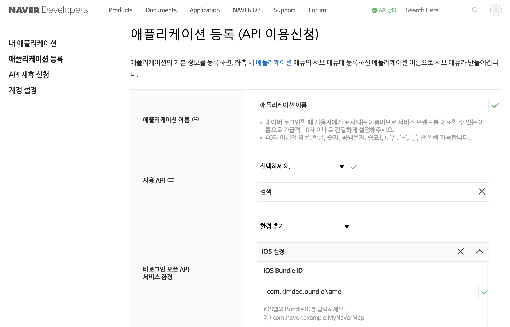
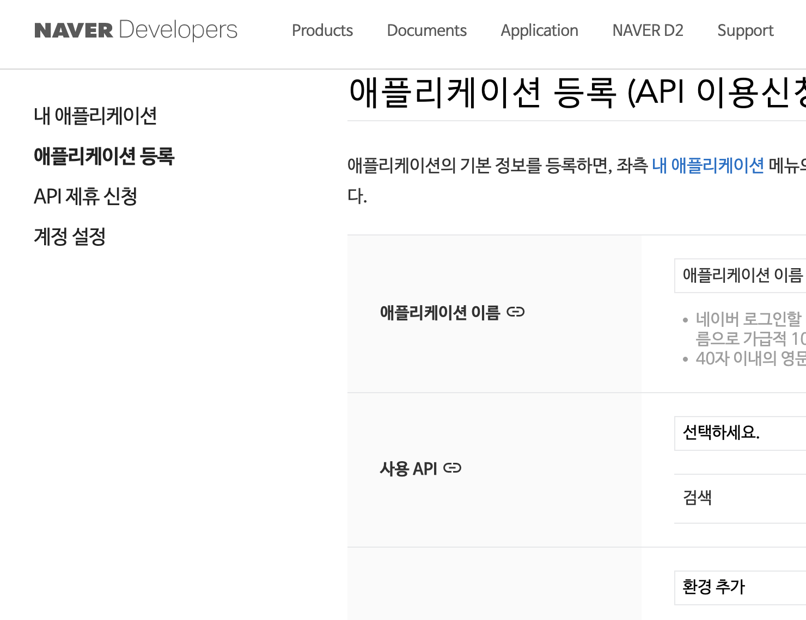
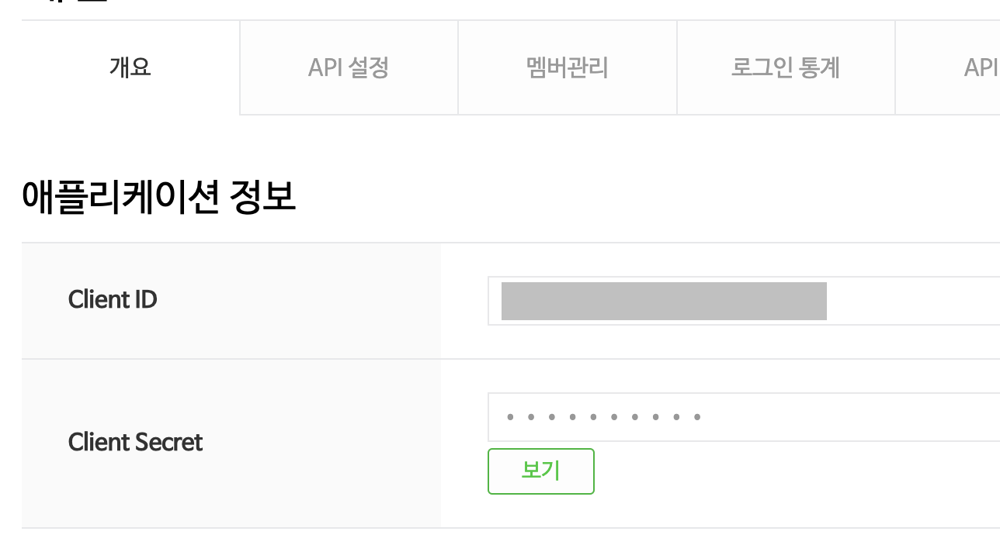
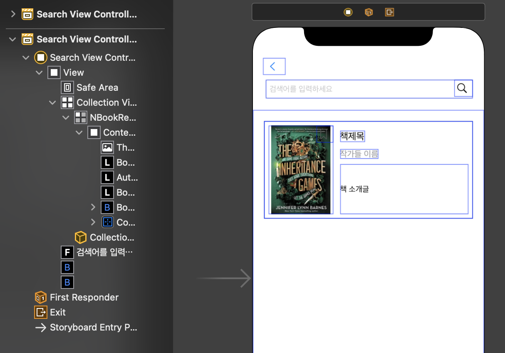
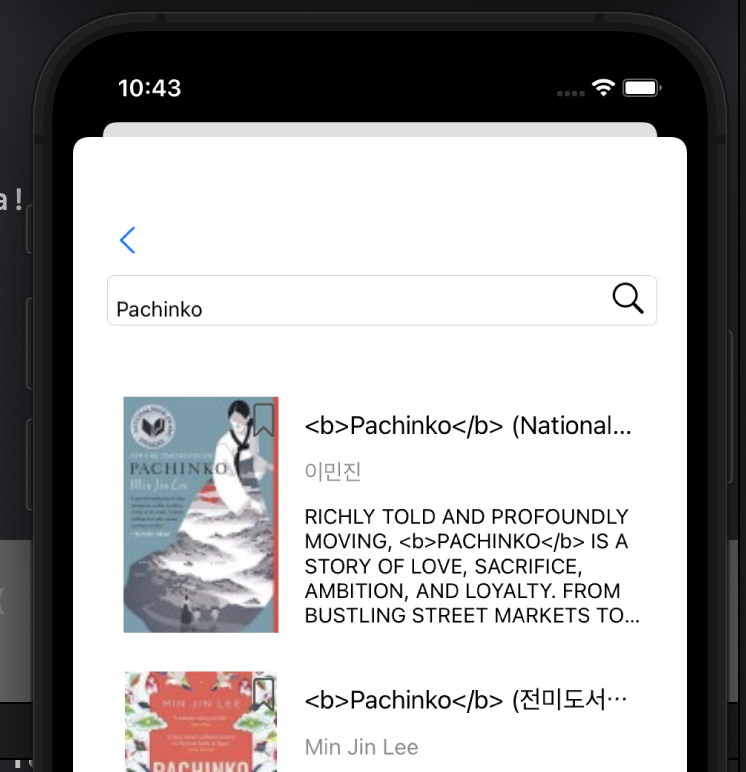
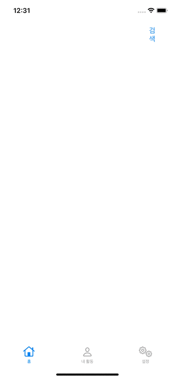

## 들어서며

지난번에 카카오 API에서 다룬 바와 같이 Alamofire를 이용해 동일한 형태의 함수를 이용하기 때문에 이번에는 콜렉션 뷰를 이용해 전체 검색결과를 불러옵니다. 카카오와 다르게 네이버의 경우 검색결과에 HTML 태그가 포함되서 오므로, 정규식을 활용하여 문자열을 대체하는 메서드도 사용해봅니다. 

## 목표

* 네이버 REST API 등록하기
* 검색 내용을 받아올 구조체 만들기
* 검색한 내용이 들어갈 콜렉션 뷰 만들기 
* API로 책 검색한 내용 가져오기
* 검색한 내용을 콜렉션 뷰 셀에 넣어 보여주기 

- - -

## 시작하기

### 네이버 API 등록하기



네이버의 책 검색을 하기 위해서는 [네이버 개발자 사이트](https://developers.naver.com/apps/#/register)에서 로그인 후 **\[Application] > \[애플리케이션 등록]** 을 해야합니다.



애플리케이션 이름, 사용 API, 개발 환경을 추가해야합니다. 한 번 등록하면 따로 개발하는 앱과 웹의 정보 없이도 자동적으로 여러 환경에 대한 APP KEY가 나오는 카카오와 달리, 개발하고 있는 앱의 번들 ID, 웹의 링크를 최소 하나 이상 추가해야합니다. 저는 검색 API만 사용하여 iOS 환경만 개발할 예정이므로 위와 같이 선택했지만, 드롭다운 메뉴를 눌러 사용하려는 API와 환경을 계속 추가할 수 있습니다. 

혹시 처음 등록할 때 추가하지 않았더라도, \[내 애플리케이션]에 들어가서 API 설정을 통해 사용하는 API와 환경을 추가할 수 있습니다. 



이제 \[Application] > \[내 애플리케이션]에서 아까 등록한 앱을 선택해서 들어가면 클라이언트 ID와 클라이언트 Secret을 확인할 수 있습니다. 이 값들은 나중에 네트워킹할 때 헤더 영역에 각각 **X-Naver-Client-Id**, **X-Naver-Client-Secret** 키에 밸류로 들어가게 될 값들입니다. 

- - -

## 검색내용을 받아올 구조체 만들기

\[API 이용안내] > \[검색]에서 [책 검색 API 설명 링크](https://developers.naver.com/docs/serviceapi/search/book/book.md#%EC%B1%85)를 보고 구조체를 만듭니다. 

카카오와는 조금 다르게, JSON 데이터 가장 상위에 검색한 책 정보 배열이 저장되는 items 외에 마지막으로 빌드한 날짜 **lastBuildDate**, 총 검색결과 수 **total**, 검색결과 시작위치 **start**, 검색 결과 출력건수 **display** 가 있습니다.

```
struct NBookSearchResult : Codable {

    let lastBuildDate: String
    let total: Int
    let start: Int
    let display: Int
    let items: [NBookInfo]
}

struct NBookInfo: Codable {
    let title: String
    let link: String
    let image: String
    let author: String
    let price: String
    let discount: String
    let publisher: String
    let pubdate: String
    let isbn: String
    let description: String
}
```

- - -

## 검색한 내용이 들어갈 콜렉션 뷰 만들기

### 스토리보드로 화면 디자인

스토리보드에 UIViewController를 새로 만들고, 검색 내용을 입력할 텍스트필드와 검색 버튼을 두고 그 아래에는 콜렉션 뷰를 위치시킵니다. 

콜렉션 뷰 셀을 추가해서 간단하게 디자인을 해줍니다. 



저는 가져오는 검색결과에서 책 표지 이미지 **image**, 제목 **title**, 작가 **author**, 책 설명 **description**을 가져와서 위와 같은 형태로 보여줄 예정입니다. 

### 코드에서 컬렉션 뷰 등록

```
class NSearchViewController: UIViewController {

    @IBOutlet weak var collectionView: UICollectionView!

    // MARK: - Lifecycle
    override func viewDidLoad() {
        super.viewDidLoad()

        // 콜렉션 뷰 등록
        collectionView.delegate = self
        collectionView.dataSource = self
    }

}

// 콜렉션 뷰 설정하기 
extension NSearchViewController: UICollectionViewDataSource {

    
    func collectionView(_ collectionView: UICollectionView, numberOfItemsInSection section: Int) -> Int {
        return resultList.count
    }
    
    func collectionView(_ collectionView: UICollectionView, cellForItemAt indexPath: IndexPath) -> UICollectionViewCell {
        
        guard let cell = collectionView.dequeueReusableCell(withReuseIdentifier: "NBookResultCell", for: indexPath) as? NBookResultCell else {
            return UICollectionViewCell()
        }
        
        let result = resultList[indexPath.item]
        cell.configure(result)
        
        return cell
    }

    
    // 해당 셀이 눌렸을 때
    func collectionView(_ collectionView: UICollectionView, didSelectItemAt indexPath: IndexPath) {
        // 화면 띄우기
    }
}

extension NSearchViewController: UICollectionViewDelegateFlowLayout {
    func collectionView(_ collectionView: UICollectionView, layout collectionViewLayout: UICollectionViewLayout, sizeForItemAt indexPath: IndexPath) -> CGSize {
        let inset: CGFloat = 20
        let width: CGFloat = collectionView.bounds.width - (inset * 2)
        let height: CGFloat = 175
        
        return CGSize(width: width, height: height)
    }
}
```

**UICollectionViewDelegateFlowLayout**으로 다른 디바이스에서도 레이아웃이 깨지지 않게 조정합니다. 

### 텍스트필드와 버튼 액션

```
    @IBAction func didTextFieldEditingChanged(_ sender: TextFieldEffects) {
        
        let text = sender.text ?? ""
        
        self.query = text
    }
    
    @IBAction func didSearchButtonTapped(_ sender: UIButton) {

        searchHelper()
   
    }
```

- - -

## API로 책 검색 내용 가져오기

Alamofire를 이용해 쿼리를 통해 검색한 결과를 위에 선언해둔 구조체로 디코딩해서 가져옵니다. 이 부분은 전에 쓴 [Kakao REST API를 이용해 책 검색 내용 가져오기](https://kimdee.netlify.app/blog/swift%EC%97%90%EC%84%9C-%EC%B9%B4%EC%B9%B4%EC%98%A4-rest-api-%EC%9D%B4%EC%9A%A9%ED%95%B4%EC%84%9C-%EC%B1%85-%EA%B2%80%EC%83%89-%EB%82%B4%EC%9A%A9-%EA%B0%80%EC%A0%B8%EC%98%A4%EA%B8%B0/) 와 동일한 형태의 코드입니다.  

```
 func searchHelper() {
        self.fetchSearchResult ( completionHandler: {[weak self] result in
            guard let self = self else { return } // 일시적으로 self가 strong reference로 만들게 하는 작업
               switch result {
               case let .success(result) :
                   debugPrint("success \(result)")
                   self.resultList = result.items
               case let .failure(error) :
                   debugPrint("error \(error)")
           }
            
        })
        
        collectionView.reloadData()
    }
    
    func fetchSearchResult(
        completionHandler: @escaping (Result<NBookSearchResult, Error>)-> Void
    ) {
        let url = "https://openapi.naver.com/v1/search/book.json"
        let headers: HTTPHeaders = [
            "X-Naver-Client-Id" : "클라이언트 ID",
            "X-Naver-Client-Secret" : "클라이언트 Secret"
        ]
        let body: Parameters = [
            "query" : self.query,
        ]
        
        AF.request(url,
                   method: .get,
                   parameters: body,
                   headers: headers)
        .responseData(completionHandler: { response in
            switch response.result {
            case let .success(data) :
                do {
                    let decoder = JSONDecoder()
                    let result = try decoder.decode(NBookSearchResult.self, from: data)
                    completionHandler(.success(result))
                    
                } catch {
                    completionHandler(.failure(error))
                }
            case let .failure(error) :
                completionHandler(.failure(error))
            }
            
        })

    }
```

- - -

## 검색한 내용을 콜렉션 뷰 셀에 넣어 보여주기

위에 테이블 뷰 선언에서 **cellForItemAt** 이 들어간 콜렉션 뷰 메서드 내에 아래와 같은 코드가 보였을 것입니다. 

```
let result = resultList[indexPath.item]
cell.configure(result)
```

**searchHelper()** 메서드에서 네트워킹에 성공했을 경우 **resultList**에 **result.items**를 받아두었습니다. 이 프로퍼티는 \*\*viewDidLoad() 윗 부분에서 아래와 같이 선언해두었습니다. 

```
var resultList = [NBookInfo]()
```

받아온 결과를 셀 디자인에 잘 적용하기 위해서 셀의 클래스를 따로 만들고, 책정보를 받아와서 셀의 뷰 요소 안에 적용하는 **configure** 메서드를 정의하였습니다.

```
class NBookResultCell: UICollectionViewCell {
    
    // MARK: - Properties
    static let identifier = "NBookResultCell"
    
    @IBOutlet weak var thumbnailImageView: UIImageView!
    
    @IBOutlet weak var bookmarkButton: UIButton!
    @IBOutlet weak var bookTitleLabel: UILabel!
    @IBOutlet weak var authorsLabel: UILabel!
    @IBOutlet weak var bookContentsLabel: UILabel!
    
    
    // MARK: - Actions
    func configure(_ result: NBookInfo) {
        // 아이템 가져와서 셀 뿌리기
        let url = URL(string: result.image)
        DispatchQueue.global().async {
            let data = try? Data(contentsOf: url!)
            DispatchQueue.main.async {
                self.thumbnailImageView.image = UIImage(data: data!)
            }
        }
        
        authorsLabel.text = result.author
        bookmarkButton.setTitle("", for: .normal)
        bookTitleLabel.text = result.title 
        bookContentsLabel.text = result.description
    }
}
```

여기서 빌드했을 때 아래와 같이, 책 제목과 소개글에 HTML가 붙는 것이 영 보기 좋지 않습니다.




### 데이터 내의 HTML 태그 지우기

`String` 구조체의 메서드 중 `.replacingOccurences()`를 이용해 HTML 태그를 지울 수 있습니다. 정규식을 이용해 HTML 태그 형태로 된 단어들을 빈 문자열로 대체합니다.

```
bookContentsLabel.text = result.description.replacingOccurrences(
            of: #"<[^>]+>"#,
            with: "",
            options: .regularExpression,
            range: nil)
```

- - -

## 완성화면



---

## 마치며 

네이버와 카카오의 검색 API 사용을 비교해볼 수 있었습니다. 앞으로도 검색 API 말고 다른 오픈 API도 이것저것 써보면서 실습한 결과를 종종 써보고자 합니다. 

그 전에 XML로 네이버 상세검색을 먼저 사용하고자 합니다. 기실 개인 프로젝트에 들어가는 책 검색에서 가장 필요한 부분은 장르검색인데, 이 부분은 **XML** 로 데이터를 받아오는 상세검색을 이용해야합니다. XML이 무엇이 어떻게 다룰지 찾아보고 실습해본 결과는 다음 글에서 다뤄보겠습니다. 

감사합니다. 
