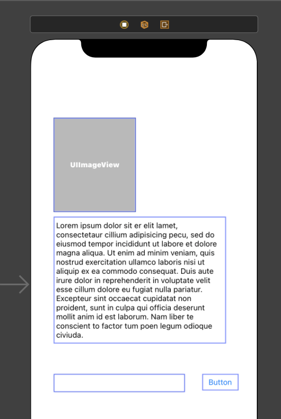
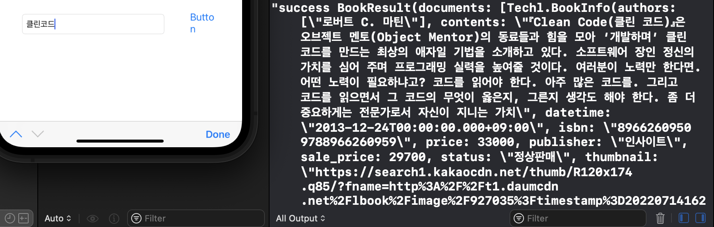
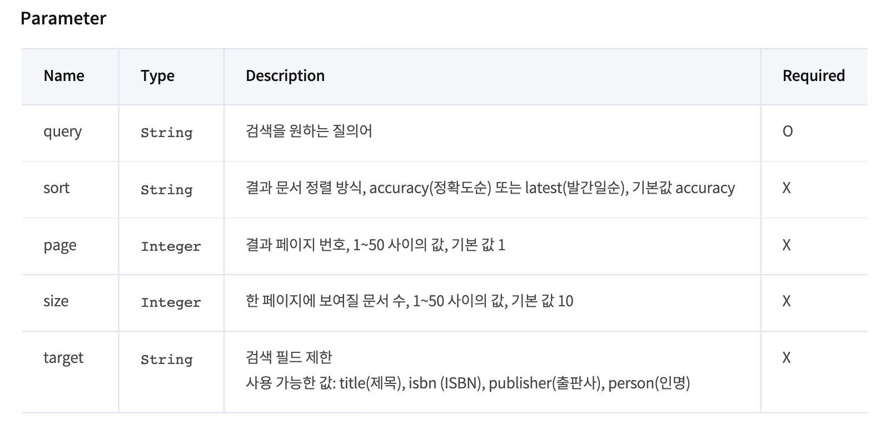

# 들어서며

개인 프로젝트로 책 검색 API 쓸 일이 생겼는데요. 네이버와 카카오를 비교해보고 싶어서 실습을 해보게 되었습니다.  


# 목표

* KaKao REST API 등록하기 
* API로 책을 검색한 내용을 가져오기
* JSON 데이터를 Codable한 구조체로 가져오기 
* 검색결과 중 첫번째 항목을 화면에 보여주기


- - -

# 시작하기


## 카카오 API 등록하기


[Kakao Developers](https://developers.kakao.com/console/app) 에 서 애플리케이션을 등록하면 앱 키를 받을 수 있습니다. 이 중 REST API 키를 사용하는데 중요한 것은 "KakaoAK (앱키)" 형태로 들어가야한다는 점입니다. **KakaoAK** 뒤에 스페이스 한 칸이 들어가고 그 후에 발급받은 REST API키를 써야하는데 스페이스 한 칸이 있는 걸 모르고 한 30분은 안되는 이유를 찾느라 고생했습니다. 


## JSON 데이터를 가져올 구조체 선언

책 검색은 카카오의 다음검색 개발가이드에 있습니다. 이 [링크](https://developers.kakao.com/docs/latest/ko/daum-search/dev-guide#search-book)를 참고해서 검색결과인 JSON 데이터를 가져올 구조체를 선언하였습니다. 

이 때 **[Codable](https://developer.apple.com/documentation/swift/codable)**을 상속받아야합니다.

Codable API를 통해 JSON과 같은 직렬화된 데이터포맷(Serialized Format)으로 인코딩 또는 디코딩할 수 있습니다. 

Codable은 *Encodable*과 *Decodable* 프로토콜을 합친 타입앨리어스로, Codable 하나를 상속받음으로써 선언한 인스턴스를 *JSONEncoder*를 통해 JSON 형태로 변환하고, *JSONDecoder*를 통해 다시 사용자가 만든 인스턴스 형태로 변환할 수 있습니다. 

```
let encoder = JSONEncoder()
let data = try encoder.encode(myinstance)

let decoder = JSONDecoder()
let myDecodedInstance = try decoder.decode(myInstance.self, from: data)
```

[Swift by Sundell](https://www.swiftbysundell.com/basics/codable/#:~:text=Introduced%20in%20Swift%204%2C%20the,Encodable%20and%20Decodable%20%E2%80%94%20into%20one.)에 나온 내용을 참고하였습니다.

위를 토대로 아래와 같이 구조체를 선언하였습니다. API를 호출하면 documents 안에 배열 형태로 JSON이 저장되어 있어서 아래와 같은 구조로 만들었습니다. 

```
struct BookResult: Codable {
    
    let documents: [BookInfo]
}

struct BookInfo: Codable {
    let authors: [String]  // 작가들 배열
    let contents: String  //소개글
    let datetime: String //출간일
    let isbn: String // ISBN
    let price: Int // 정상가
    let publisher: String // 출판사
    let sale_price: Int // 세일가
    let status: String // 정상판매 여부
    let thumbnail: String // 이미지링크
    let title: String // 책제목
    let translators: [String] // 번역가 배열
    let url: String // 책검색결과 링크
}
```

## 데이터를 Alamofire로 Fetch해오는 함수

다음으로 API를 통해 검색한 내용을 Fetch 해오는 함수를 만들었습니다. 

*[Alamofire](https://github.com/Alamofire/Alamofire)*는 HTTP 네트워킹 라이브러리로 Swift에서 기본으로 제공하는 *URLSession*보다 훨씬 편리하게 코드를 짤 수 있습니다. 

저의 경우 기존에 작업하던 프로젝트에 Kakao SDK를 Swift Package Manager를 이용해 설치해두었는데, Kakao SDK가 Alamofire를 포함하고 있어서 자동으로 설치가 됐습니다. 만약 없다면 위에 언급한 Swift Package Manager나 Cocoapod을 이용해 Alamofire를 추가해주어야 합니다. 


```
func fetchSearchResult(
        completionHandler: @escaping (Result<BookResult, Error>)-> Void
    ) {
        let url = "https://dapi.kakao.com/v3/search/book"
        let headers: HTTPHeaders = [
            "Authorization" : "KakaoAK (REST API )"
        ]
        let body: Parameters = [
            "query" : self.query

        ]
        
        AF.request(url,
                   method: .get,
                   parameters: body,
                   headers: headers)
        .responseData(completionHandler: { response in
            switch response.result {
            case let .success(data) :
                do {
                    let decoder = JSONDecoder()
                    let result = try decoder.decode(BookResult.self, from: data)
                    completionHandler(.success(result))
                    
                } catch {
                    completionHandler(.failure(error))
                }
            case let .failure(error) :
                completionHandler(.failure(error))
            }
    
        })
    }
```

## 키워드를 입력 후 검색 버튼 눌렀을 때 fetch하는 함수 호출하기

제 경우 화면에 텍스트필드와 버튼을 이용해, 텍스트필드 안의 내용을 버튼을 탭했을 때 가져와 API를 이용해 검색하도록 구현하였습니다. 



### 키워드 입력 시 저장

```
 @IBAction func queryEditingChanged(_ sender: UITextField) {
        let text = sender.text ?? ""
        
        self.query = text
    }
    
```

#### 

### 검색 버튼 입력시 fetch 호출

```
    @IBAction func didButtonTapped(_ sender: UIButton) {
        searchHelper()
        
        
    }
```

### fetch를 도와주는 함수

```
    func searchHelper() {
        self.fetchSearchResult ( completionHandler: {[weak self] result in
            guard let self = self else { return } // 일시적으로 self가 strong reference로 만들게 하는 작업
                       switch result {
                       case let .success(result) :
                           debugPrint("success \(result)")
                           self.configureResult(result: result.documents[0])
                       case let .failure(error) :
                           debugPrint("error \(error)")
           }
            
        })
    }
```

함수를 불러오면서 데이터를 가져오는 데 성공했으면 콘솔에 해당 데이터를 확인하는 코드를 넣었는데요. 




잘 가져온 것을 확인할 수 있습니다. 


## 검색한 결과 중 첫번째 항목을 화면에 보여주기

따로 테이블뷰를 만들지는 않았고, 이미지뷰와 텍스트뷰만 화면에 올려두었습니다. 가져온 데이터 중에서 첫번째 항목의 썸네일 이미지와 도서소개글만 각 해당하는 뷰에 넣어주었습니다.  

```
    func configureResult( result: BookInfo) {
        self.resultTextView.text = result.contents
        let url = URL(string: result.thumbnail)
        DispatchQueue.global().async {
            let data = try? Data(contentsOf: url!)
            DispatchQueue.main.async {
                self.resultImageView.image = UIImage(data: data!)
            }
        }
    }
```

## 완성된 모습


잘 가져오는 것을 확인할 수 있습니다. 


- - -

# 마치며

카카오 책 검색 API 에서는 검색할 수 있는 조건은 아래와 같이 질의어를 통해 제목, ISBN, 출판사, 인명(저자, 역자)만 검색할 수 있는데요. 

 




그러다보니 장르별로 검색할 수 없어서 아쉬움이 남습니다. 네이버의 경우 책 검색 시 장르 검색이 가능한 것으로 보여서 다음 글로 실습결과를 공유하고자 합니다. 

읽어주셔서 감사합니다.