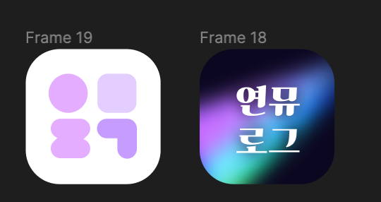
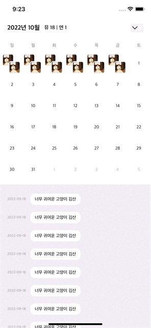

시작하기에 앞서, 연극과 뮤지컬을 보고난 후 스스로에게 말하듯 후기를 적을 수 있는 앱 연뮤로그가 10월 7일 금요일에 1.0 버전을 첫 출시 했습니다. 💕

아직 부족하지만 꾸준히 업데이트해서 잘 키워보겠습니다. 혹시 피드백이 있으시다면 [인스타그램 DM](https://www.instagram.com/yeonmulog/)으로 부탁드립니다. 언제나 감사합니다. 

[‎연뮤로그 다운로드 링크](https://apps.apple.com/kr/app/%EC%97%B0%EB%AE%A4%EB%A1%9C%EA%B7%B8/id6443663023)

- - -

# 아이디어의 시작

연뮤로그는 새싹 2기 iOS 부트캠프에서 진행한 개인 출시 프로젝트인데요. 처음 프로젝트를 시작할 때 즈음 눈앞에 들어왔던 책은 바로 이 책이었습니다. 

<기록집 100, 보고 쓰고 그린 100편의 공연>

2020년 중순, 팬데믹으로 공연계도 얼어붙었던 시기에, [크라우드 펀딩](https://www.tumblbug.com/record100)을 통해 구매한 책입니다. 100편의 공연을 보고 글과 그림으로 기록한 책인데요. 이 책을 보고 불현듯 19년도까지 함께 뮤지컬을 보던 친구 H와의 대화를 홀린 듯 찾아보게 되었습니다. 

심지어 7월에도 이런 얘기를 나눴어요. 제가 7월 중순에 동생과 함께 쓰릴미를 봤거든요. 제 인생 첫 쓸… 

쓰릴미를 보고 난 후 친구와 나눈 이야기 

H와는 18년도에 키다리아저씨 회전문을 함께 돌면서 (저는 거의 끝물에 시작했더니 자리가 많이 없어서 사실 많이 보지 못했어요ㅠ속상… ) 뮤지컬 얘기를 자주 하게 되었는데요. 제가 좋아하는 배우의 새로운 극 정보도 알려주고 제 뮤지컬 후기도 열심히 들어주는 친구입니다. 가끔 쓰는 인스타그램이나 다이어리보다 친구에게 뮤지컬 얘기를 더 많이 했더라고요. 

어디든, 누군가에게 보여지는 공간에서는 문장을 잘 정리해야된다는 생각에 오히려 잘 못 올리게 되는데, 친구와 자유롭게 생각나는 내용들을 얘기하는 이 느낌이 참 좋았어요. 

H도 비공개로 따로 트위터에 타래로 정리하던 걸 보여주면서 앱개발에 대한 아이디어를 나눠주었습니다. 덕분에 앱의 방향성에 대해 많은 도움을 받을 수 있었어요. 업데이트 예정 중에 **개발자소개** 페이지가 있는데, 이 화면에서 따로 헌사하기로 약속했습니다. 

# 초기 컨셉 1.0

그래서 처음 아이디어는 아래와 같았습니다. 정확히는 새싹의 멘토님들께 피드백 받은 내용을 반영한 컨셉인데요. 본래는 하루에 낮공,밤공을 다 볼 경우를 생각만 하고 기획에는 적용을 안했는데 바로 그 부분을 캐치해서 피드백을 해주셨습니다. 그 피드백을 적용한 화면이에요.

프레임명조차 바꿔주지 않았던, 사장된 비운의 첫 아이콘 이미지

달력 위 포스터를 클릭하면 썼던 후기들을 볼 수 있고, 채팅창처럼 후기를 쓸 수 있어요.

초기 컨셉에서 가장 중요하게 잡았던 부분은 크게 세 가지였습니다. 

<aside>
1️⃣ 관극한 날짜에 해당 공연 포스터가 들어가게, 하지만 PL@Y 앱과는 다른 방식으로 포스터 보여주기

</aside>

<aside>
2️⃣ 달력 아래로는 채팅 메신저의 ‘나에게 보내기’처럼 쭉 후기 내용들을 보낼 수 있게하기

</aside>

<aside>
3️⃣ 목록보기로 같은 극을 공연날짜별로 나눠서 볼 수 있게 하기

</aside>

열심히 관극해서 캘린더를 포스터로 채우는 것도 기분 좋을 것 같고, 공연 날짜를 클릭해서 채팅처럼 쓸 수 있는 후기도 좋고, 목록으로 모아볼 수 있는 것도 좋아서 *‘이대로 구현만 하면 되겠다!’* 하고 마음을 놓고 있었습니다. 하지만 제 개발운명에 처음으로 드리워진 암운을, 저는 보지 못했던 거죠… 

## 일주일동안의 FS캘린더 삽질

공연기록으로 워낙 유명한 앱인 [PL@Y](https://apps.apple.com/kr/app/pl-y2-%ED%94%84%EB%A6%AC%EB%AF%B8%EC%97%84-%ED%8B%B0%EC%BC%93%EB%B6%81/id1159328039)가 있는데요. 아래처럼 관람한 공연의 포스터를 달력에 추가할 수 있습니다. 

PL@Y의 경우 이렇게 캘린더를 통으로 한 탭에 쓰고 있는데요. 제 앱은 클릭한 날짜의 후기가 캘린더 밑에 보여야 하기 때문에 이렇게 캘린더를 크게 잡을 수 없었습니다. 네비게이션바와 탭바, 그리고 후기를 작성하는 컨트롤러영역을 제외한 공간의 70% 정도를 잡아두었는데요. 그러다보니 캘린더 자체가 커질 수가 없었습니다.

또한 캘린더 셀에  들어가는 포스터 이미지를 PL@Y와 유사성이 느껴지지 않도록 만들어야 하는게 중요한 부분인데요. 

위 두가지를 합쳐서 구현하다보니, 흡사 징그럽게도 느껴질 캘린더가 되고 맙니다.

## 환공포를 유발하는 캘린더 이미지 썸네일

### 1) 관극한 공연의 포스터로 날짜를 덮어버리는 캘린더 셀 디자인

FSCalendar 라이브러리를 이용했는데요. 

날짜에 들어가는 포스터 이미지는 캘린더 셀 콘텐트뷰에 서브뷰를 삽입하여 이미지를 씌웠습니다. 

날짜가 안보이니까 이상해 보이는걸까..? 싶어서 날짜를 가리지 않고 위로 올리기로 결정합니다. 

### 2) 날짜 밑에 포스터가 들어가는 캘린더셀

매번 [Snapkit](https://github.com/SnapKit/SnapKit) 에서 `makeConstraints` 메서드만 쓰다가 `remakeContstriants`를 처음 이용해봤는데요. 이 메서드는 기존에 Snapkit에서 설정한 제약조건을 모두 지우고 괄호안에 새로 작성한 제약조건을 적용해줍니다. FSCalendar가 Snapkit 으로 만들어져있는지는 확인하지 못했지만, 어찌됐든 기존의 날짜 셀의 타이틀 레이블의 제약조건을 다시 걸어주는 것이다보니 remake를 사용해서 위치조정을 해봤습니다. 

아 근데 생각보다… 생각보다 정말 그냥 여전히 구려요… 

심지어 이게 더 정신이 없습니다… 

월간 보기 말고 주간보기로 `scope`를 `week`로 바꿔보아도 이 다닥다닥한 징그러움에서 벗어날 수가 없습니다. 

### + 이번달만 보여주고 싶은데요.. 왜 안돼요..? (아직 해결방법을 찾는중)

* 아니 근데 전월과 명월이 같이 캘린더로 보이길래 보여주고 싶어서 [FSCalendar의 이슈 #372](https://github.com/WenchaoD/FSCalendar/issues/372)의 댓글을 참고했는데요 

제가 willDisplay 메서드에서 포스터 이미지를 셀에 넣는데요. 이게 안보이게 됩니다. 

텅…텅…

이슈 댓글중에 minimumDate와 maximumDate를 쓰라고 하길래 한 번 써봤는데요. 물론 안된다는 댓글이 있었지만 제가 눈으로 확인하고 싶었습니다. 

테스트를 위해서 오늘 날짜를 반환해보았는데요. 

그 경우 지정한 날짜 이전은, 작월과 명월 날짜처럼  회색이 됩니다. 저는 아예 시야에서 없애주고 싶었거든요..

너무 다닥다닥해서 징그러워 보이기 때문입니다. 아래처럼요. 

다시 찾아보니 아래 https://github.com/WenchaoD/FSCalendar/issues/168 #168 이슈에서 개발자가 직접 단 댓글에서 이 feature를 구현했다는 내용이 있었습니다. 근데 그게 바로 위에서 이미 해봤던 `calendarType = .none` 입니다. 

일단 연뮤로그 1.0 버전에서는 심장을 도려내는 마음으로ㅠ 달력뷰를 뺐는데요. 아래 컨셉 2.0의 네비게이션 바 타이틀을 보시면 유추할 수 있을 것 같아요. **달력으로 보기**도 넣을거거든요! 일단 캘린더 타입을 `.none`으로 하면서도 셀이 제대로 보여지도록 방법을 좀 더 찾아보겠습니다. 

## 이 쯤 되니까 직접 캘린더를 만들어야 되나 싶은데 일주일이 지나갔습니다

이렇게 선언해두고 [RayWenderlich](https://www.raywenderlich.com/10787749-creating-a-custom-calendar-control-for-ios) 에서 튜토리얼도 열어보고 있었는데요. 불현듯 깨달은 사실이 있었습니다. 

> 출시프로젝트기간 한달 중에 심사신청 넣는 걸 빼면 3주인데.. 근데 내가 지금 1주일을 날렸다고..? 
> 이제 남은 개발기간이 .. 2주..? 14일? 겨우 336시간..? 여기에 자고 먹고 팀빌딩하고 수업듣는 시간도 포함된다고..?

너무 무섭고요. 소름이 돋았습니다. 

그래서 결국 캘린더를 제외하기로 마음먹었습니다. 

# 캘린더도 없고 목록보기도 없고, 리뷰말고 다 바뀐 컨셉 2.0

시간이 정말 부족하지만 UI의 퀄리티는 높이고 싶었습니다. 캘린더 영역이 앱의 아이덴티티가 드러나는 부분이라고 생각했는데, 그런 캘린더를 포기하자니 무언갈 대체해야된다고 생각했어요. 

## 로고에서 따온 새로운 캐릭터 ’ㄹ’ 의 등장

연뮤로그의 로고는 앱 이름의 초성을 형상화했는데요. **연뮤**는 연극과 뮤지컬을 의미하고, **로그**는 기록을 의미하는 한자 록(**錄),** 기록하다라는 뜻의 log, 나에게 보내기처럼 작성하는 형태이기 때문에 독백을 의미하는 monologue에서 따왔습니다. 

그렇다보니 연뮤로그의 로고 중 ‘ㄹ’부분이 후기를 쓰는 사용자를 표현할 수 있다는 생각이 들었어요. 

그래서 아래와 같은 ‘ㄹ’ 캐릭터를 새로 만들게 되었습니다. 

그리고 사용자에게 안내해줄 수 있는 영역에 ‘ㄹ’을 배치하였습니다. 

## 타래로 보기, 스레드

트위터의 타래, 스레드에 영감을 받아 만들었습니다. 관극한 기록들을 이름, 날짜, 캐스팅, 장소와 리뷰 숫자를 이용해 볼 수 있고, 클릭하면 스레드에서 리뷰와 극 상세정보를 볼 수 있게 화면 디자인을 바꿨습니다. 

그런데 그거 아세요? 사실 타래로 보기와 스레드를 구분하면 안됐습니다. 스레드와 타래 모두 같은 의미기 때문인데요. 정확히는 타래(=스레드)목록, 타래(=스레드)식으로 네비게이션 타이틀을 지었어야 합니다. 이 사실은 1.0 출시 이후에 깨닫게 되었습니다. 

## 리뷰 기록창 디자인 개선

기존에는 바로 텍스트를 입력할 수 있는 창을 디자인했는데요. ***채팅창처럼 나 혼자 말하는 리뷰!*** 가 컨셉이기 때문에 이렇게 잡았지만 아무래도 리뷰를 작성하지 않고 구경만 할 수도 있고, 화면을 항상 가리고 있는 점이 아쉬웠습니다. 

그래서 비슷한 앱으로 **Drawer Journal** 에서 힌트를 얻어 화면을 디자인했습니다. 여기서도 버튼을 누르면 리뷰창이 뜨는 형태더라고요. 그래서 말풍선이 그려진 보라색 버튼을 누르면 리뷰창이 열리는 식으로 UI와 UX를 바꾸었습니다. 

초기 컨셉에서의 리뷰 기록창

2.0 에서 바뀐 기록창

## 음성메모의 추가

위에서 큰 영감과 도움을 준 친구 H의 피드백을 반영한 것 중 하나가 음성메모입니다. 관극하고 나서 귀갓길에 빠르게 감상을 정리하고 싶어서 녹음해서 메모하는 경우도 많다고 하더라고요. 1.0 버전에는 빼두었지만 추후 업데이트 버전에 추가될 feature 입니다. 이에 대한 자세한 내용은 연뮤로그 개발기 2편에서 구현한 내용과 데이터베이스를 설명하면서 더 자세히 다뤄보겠습니다. 

한땀 한땀 그린 마이크. 예쁘고 캐릭터에 맞는 마이크를 그리기 위해 시행착오를 많이 겪었습니다. 

## 온보딩 화면새로 추가

초기 컨셉은, 정말 미니멀한 MVP로 디자인했다보니 온보딩 디자인이 없었습니다. 새로 캐릭터가 생겼다보니 이를 그림으로 만드는 건 굉장히 쉬운 일이었어요. 

손으로 슥슥 가볍게 그려 추가했습니다. 앱의 새로운 피쳐들을 업데이트 하면서 온보딩의 내용도 추가하고, 일러스트도 좀 더 완성도를 높여 추가할 예정입니다.  

## 통계 탭도 추가

통계는 포인트가 되는 컬러만 지정하고 [Charts](https://github.com/danielgindi/Charts) 라이브러리의 기본 디자인을 그대로 사용했습니다. 

컬러가 단일 지정되다보니 조금 심심한 감이 있어서, 포인트 컬러를 기준으로 컬러웨이를 좀더 다양하게 만들어 추후 업데이트에 추가할 예정입니다. 

# 1인 프로젝트에서의 기획과 디자인 소회

연뮤로그를 개발하면서 제가 제일 힘들었던 건, 짧은 일정도, 부족한 잠도 아니었습니다. 

기획자인 나와 디자이너인 나와 개발자인 내가 서로 협업하는 일이었습니다. 제 개발자 자아는 태어난지 얼마 안 되어서 다른 자아들에게 열심히 휘둘리고 있었어요. 안되는 걸 안된다고 말도 못하고…. 

기획자(나)와 디자이너(나) 사이에 낀 개발자(나)의 모습은 이와 같았습니다.

우리의 협업은 너무나..힘들었어요….. 이렇게 밤을 많이 새고 고민한 적이 인생에 언제 있었을까 싶어요. 

우리는 서로 사이는 너무 좋았고요. 결과도 정말 맘에 들었어요.

근데… 이건 아닌것 같았어요…

포스팅에는 쓰지 않았던 자잘자잘한 디자인 수정들… 1pt가 이상할 때마다 저는 다른 페이지도 못 만들었으면서 그 페이지에 매어있었습니다. 피그마로 미리 화면을 만들어두었지만 막상 온디바이스에서는 디자인을 고칠 부분이 눈에 많이 들어오더라고요. 

그렇지만, 기획과 디자인을 바꾸고 나서 오히려 개발이 수월해질 수 있었습니다. 일단 디자인이 맘에 들게 나오니 화면 하나 만들 때마다 성취감도 컸고요.

이전에 **[꽁냥 앱](https://kimdee.netlify.app/blog/%ED%95%99%EA%B5%90-%ED%94%84%EB%A1%9C%EC%A0%9D%ED%8A%B8%EB%A1%9C-%EC%8B%9C%EC%9E%91%ED%95%9C-ios-%EC%95%B1-%EA%BD%81%EB%83%A5-%EB%A7%8C%EB%93%9C%EB%8A%94-%EC%9D%B4%EC%95%BC%EA%B8%B0-1-1/)**을 iOS 개발 공부하려고 처음 만들었을 때오히려 이보다 디자인이 훨씬 많았지만, 디자인에 의존하여 안되는 개발을 감춘다는 느낌을 스스로  조금 받았는데요. 오히려 디자인이 아니었다 싶을 때 개발할 수 있는 역량에 맞춰 디자인을 새로 해본 경험이 오히려 신기하고 재밌더라고요!

이제 출시 이후 업데이트에서는 한동안 기획과 디자인을 수정할 일은 없고, 이미 만들어둔 기획대로 작업하면 될 거 같아서 개발자인 저 자신이 열심히 힘을 내보면 될 것 같습니다. 

다음 2편에서는 연뮤로그 1.0 버전을 개발하면서 겪었던 고통, 개발한 feature들, 트러블 슈팅들을 공유하고, 3편에서는 앱 출시 및 심사후기를 공유하도록 하겠습니다. 

여태까지 읽어주셔서 감사합니다. 

- - -

연뮤로그 인스타그램을 업데이트 소식을 빠르게 받아보실 수 있어요. 

혹시 인스타그램 계정이 있다면 팔로우해보세요!

[연뮤로그 앱 (@yeonmulog)인스타그램 팔로우하기](https://www.instagram.com/yeonmulog/)