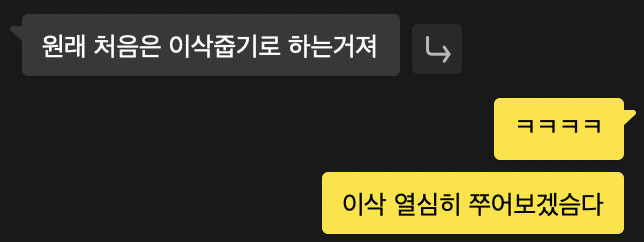
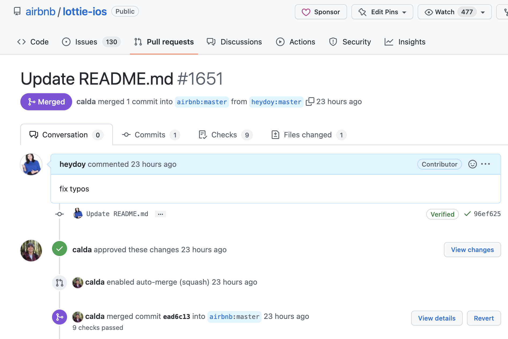

듣고 있던 새싹 교육과정에서 리드미의 오탈자 수정으로 오픈소스 컨트리뷰션을 했다는 전 기수 수강생 분에 대한 얘기를 들었는데요. 부럽기도 하고 신기하기도 해서 리드미 쥐잡듯 눈이 빠지게 보고 있다가 불현듯 '조금은 의미 없는 게 아닐까?' 하는 생각이 들어서 10+년차 개발자인 친구와 얘기를 나눴는데요. 

그래서 저는 처음이니까 이삭부터 주워보았습니다. 

제가 정말 좋아하는 오픈소스 라이브러리 중 하나인 Lottie(<https://lottiefiles.com>)의 깃허브 리드미에서 간단한 오탈자를 찾아 수정했습니다. Lottie는 Airbnb 에서 만든 라이브러리로 JSON 기반의 애니메잇션 파일 포맷입니다. 동일한 애니메이션이어도 Gif나 PNG를 이용한 애니메이션보다 용량과 속도면에서 높은 성능과 효율을 자랑하고 모든 플랫폼에서 사용할 수 있으며 픽셀 기반이 아니어서 축소,확장에 있어서 이미지가 깨질 걱정이 없습니다.

저도 연뮤로그에 위 Lottie 로딩 애니메이션을 업데이트 하였습니다. 단순히 사이즈 말고도 색상이나 프레임 속도 등 다양하게 커스텀할 수 있어 좋아요. 

참고로 연뮤로그는 아래 링크에서 다운받으실 수 있습니다. 

[https://apps.apple.com/kr/app/6443663023](https://apps.apple.com/kr/app/6443663023)

\-

## 마치며 
머지 알림을 받고 나서, 오픈소스에 아주 조금 티끌만큼 기여했다는 사실만으로도 굉장히 기분이 좋았습니다. 특히나 Lottie는 제가 좋아하기도 하고, 워낙 유명하고 큰 라이브러리다 보니 더 뜻깊었어요.

그래서 이후로도 종종 사용하고 있는 라이브러리의 이슈 탭을 유심히 보곤 하고요. 현재는 직접 오픈소스를 만들고 싶어서 프로젝트도 만들어 시간날 때마다 조금씩 수정해보고 있습니다. 곧 블로그에 공유드리도록 힘내볼게요!  