## 글을 쓰기에 앞서

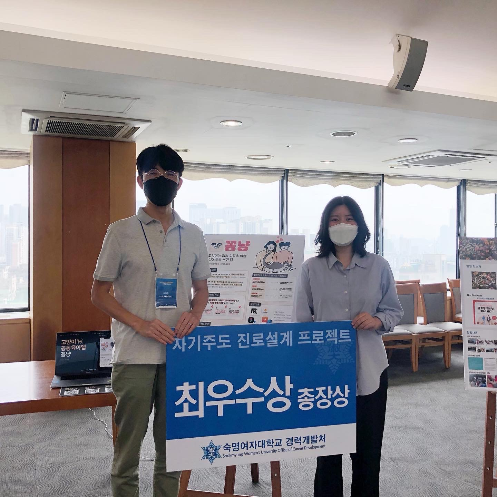

짠, 학교 프로젝트 최종발표회에서 개인으로 참석하여 최우수상을 받았습니다. 옆에 계신 분은 저의 지도교수님이에요. 


제가 개발하고 있는 <꽁냥>앱은 집사가족들을 위한 고양이 공동육아를 도와주는 앱인데요. 공동육아 투두리스트, 기호기록을 핵심기능으로 가지고 있습니다. 

현재 개발 단계는 MVP(Minimum Viable Product)수준으로, 지금하고 있는 iOS 공부와 병행하여 올해 말, 내년 초 사이에 서비스로 출시하는 것이 목표입니다. 

이 글은 한 학기동안 iOS 앱개발을 학교 프로젝트로서 하게 된 후기를 다루고자 합니다. 

- - -

## iOS 개발 공부를 시작하게 된 계기

2022년 부터 iOS 개발쪽으로 졸업 후 진로를 가져야겠다고 생각하면서 학교 프로젝트를 시작하게 됐습니다. 2021년 한 해 동안 휴학하고 스타트업에서 일하면서 진로 고민을 깊이 하게 되었는데요. UI/UX 디자인을 하면서 모바일 개발자들과 협업을 하게 되다보니 자연스레 iOS로 마음이 기울게 됐습니다. OS와 디바이스를 같이 만들다 보니 안드로이드보다 일관적인 사용자경험을 줄 수 있다는 점이 제일 좋았고요. 그런 특성 때문인지, 작년 제가 같이 일해보던 iOS 개발자분들은 UX를 디자이너보다 더 신경쓰신다는 인상이었습니다. 

그리고 무엇보다 제가 디자인을 직접 할 줄 알고, 맥북과 아이폰, 아이패드가 있어서 iOS 개발을 할 줄 알게되면 직접 제가 만든 앱을 이용할 수 있다는 점이 가장 큰 매력으로 다가왔습니다. 

## 학교 프로젝트를 신청한 이유

### 자기주도진로설계프로젝트란

**자기주도진로설계프로젝트**는 교육부에서 진행하는 '대학 진로탐색학점제' 사업의 지원을 받아서 진행되는 프로젝트입니다. 제가 다니는 학교에서도 약 [이 사업에 선정](http://www.lecturernews.com/news/articleView.html?idxno=64865)되기 3년전인 2019년도부터 이 프로젝트를 이미 진행하고 있었는데요. 

요약하자면, 학생이 직접 자신의 진로에 필요한 역량을 고려하여 스스로 한 학기분의 커리큘럼을 설계하고 이에 따라 활동하여 결과물을 제출하면 학점을 인정해주는 교과목입니다. 

프로젝트의 특성에 따라 교양이나 전공으로 3학점을 인정받을 수 있습니다.

### 신청하게 된 이유

**전공 3학점**이 가장 큰 이유지만요. 아무래도 *1) 학교 커리큘럼 중에서 iOS 공부할 수 있는 과목이 없고 2) 지도교수님의 피드백까지 받으면서 프로젝트를 할 수 있는 경험*이 될 것이라는 점이 결정적인 이유가 되었습니다. 코로나19로 인해 온라인으로 수업을 듣다보니 교수님과 아무런 라포가 형성이 되어있지 않았고, 또 제가 이번에 지도교수님으로 함께 하게 된 교수님은 워낙 학생들 사이에서 지도교수님으로 모시고 싶어하는 인기많은 교수님이다보니 저도 그 교수님께 지도받고 싶다는 생각이 있어서 이 기회를 치고 싶지 않았습니다.

## 프로젝트 진행과정

저는 전공학점으로 인정받기 위해서 학부장님과 지도교수님께 따로 커리큘럼을 아래와 같이 작성하여 제출하였습니다. 

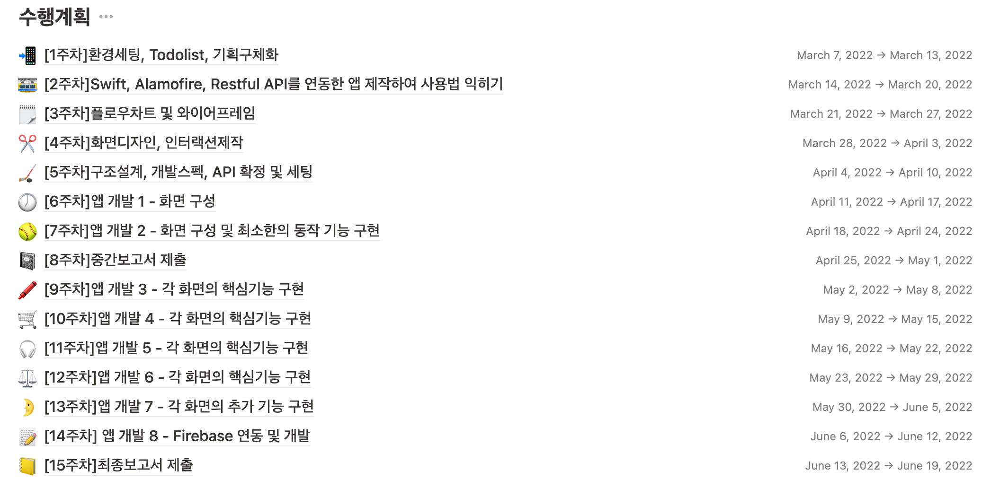

총 15주동안 이루어지며, 8주차와 15주차에 성과발표가 있고, 매주 보고서를 작성하여 지도교수님께 승인받는 형식입니다. 만약 학생의 보고가 기준 미달이어서 교수님이 승인을 해주지 않으시거나, 혹은 보고가 3차례 이상 늦어질 경우, 자동으로 Fail 처리 되고 학점인정을 받을 수 없습니다. 이게 생각보다 엄청 하드하더라고요... 함께 시작한 8팀 중에 총 7팀이 완수하셨는데 정말 대단하다고 생각이 들었습니다. 저는 정말 중간고사 기간이 되는 6주차때부터는 학업과 병행하는 게 너무 스트레스가 커서 울면서 코딩하고 빌드했거든요. 😂 

프로젝트의 기준은 일주일에 최소 5시간 이상을 프로젝트 수행시간으로 보는 건데, 아무래도 처음부터 공부하다보니 실제로는 일주일에 적게는 12시간에서 많게는 일주일 중 5일을 붙잡고 있곤 했습니다.

### \[1-2주차] 클론앱으 iOS 개발공부 / 꽁냥 앱 기획

처음 2주 동안은 [패스트캠퍼스의 강의들](https://fastcampus.co.kr/category_online_programmingapp)을 참고하면서 클론앱을 만들면서 iOS 개발 공부를 했습니다. 학기 중 프로젝트라서 신청을 2월중에 했는데, 신청함과 동시에 미리 Swift 공부와 패스트캠퍼스의 이준원님 강의를 들었기 때문에 클론앱을 만들면서 공부하는 데는 크게 어려움을 느끼지 않았습니다. 

#### 클론앱

**1) 투두리스트 클론앱** 

이 앱은 [Any.Do 앱](https://www.any.do/to-do-list-app-for-iphone/)의 클론앱인데요. 초기버전의 앱과 유사하게 클론앱을 만들었습니다. 

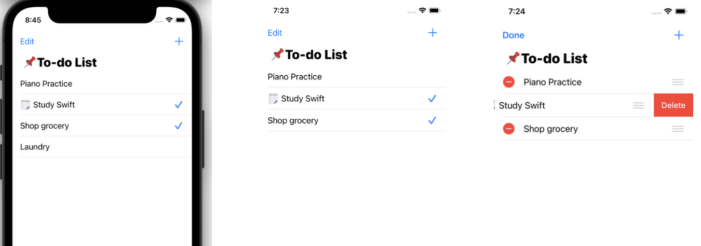

1. `+` 버튼, `AlertController` 으로 할 일 등록
2. `Edit` 버튼으로 재정렬 및 삭제
3. `TableView`의 Cell에 액세서리인 체크마크를 토글할 수 있도록
4. `UserDefaults`에 저장하여 앱을 종료하고 재실행하여도 데이터 유지

**2) 굿바코로나19 API를 이용한 현황판 앱** 

이 앱은 [굿바이코로나 19 API](https://api.corona-19.kr/)와 [Charts](https://github.com/danielgindi/Charts) 라이브러리를 이용해 현황판을 보여주는 앱입니다. `Alamofire`를 통해 네트워크 통신하는 걸 처음 해봤는데 따라치기에도 급급했어요. 

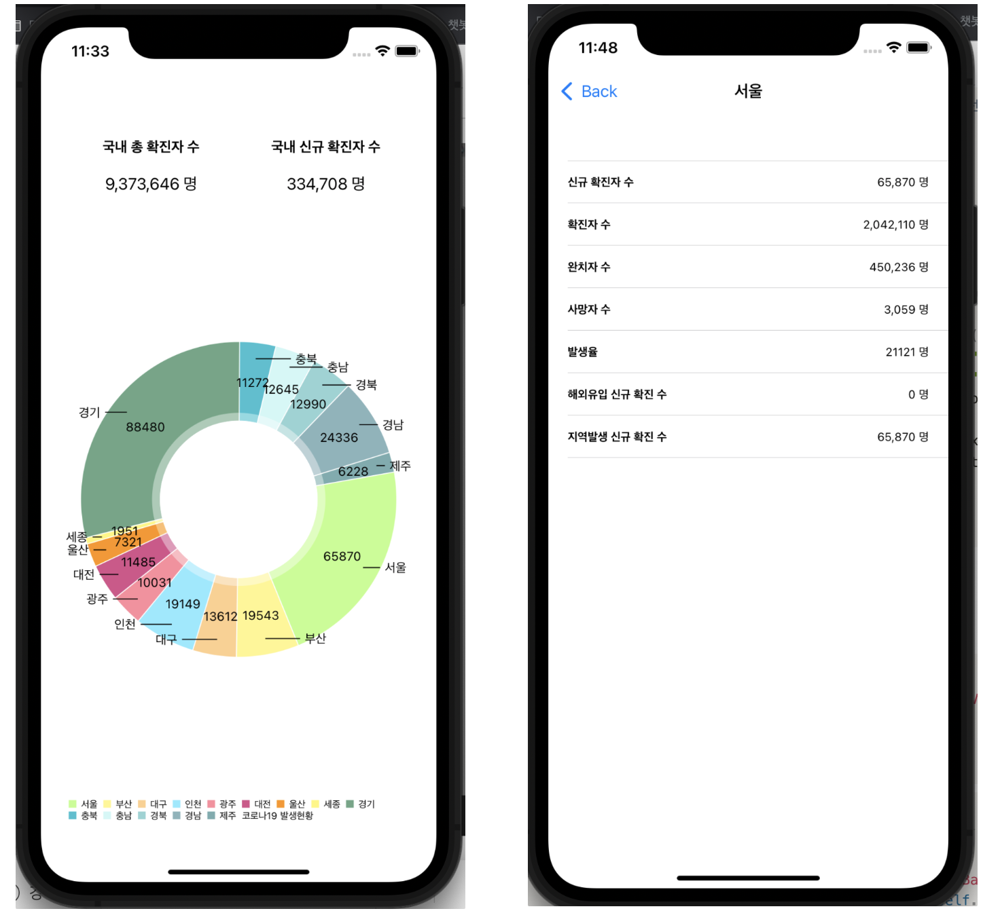

1. `Cocoapods` 이용하여 `Charts`, `Alamofire` 세팅 
2. 응답받은 `JSON`을 맵핑할 수 있는 구조체 선언 
3. `Alamofire` 를 사용해 굿바이코로나19 데이터 가져오기
4. `Charts` 에서 파이차트 뷰를 가져와 보여주기 
5. 파이차트 항목을 눌렀을 때 상세정보를 보여주기

#### 기획 및 개발환경 셋업

**1) 노션으로 개발현황 대시보드**

제가 노션을 정말 좋아하는데요. 과제를 할 때도 한글(*.hwp)파일로 작성해야되는 게 아니라면 항상 노션을 이용해서 pdf로 변환한하곤 했는데요. 노션을 대시보드로 활용해서 관리하는 걸 보고 저도 제 프로젝트에 적용해보았습니다. 

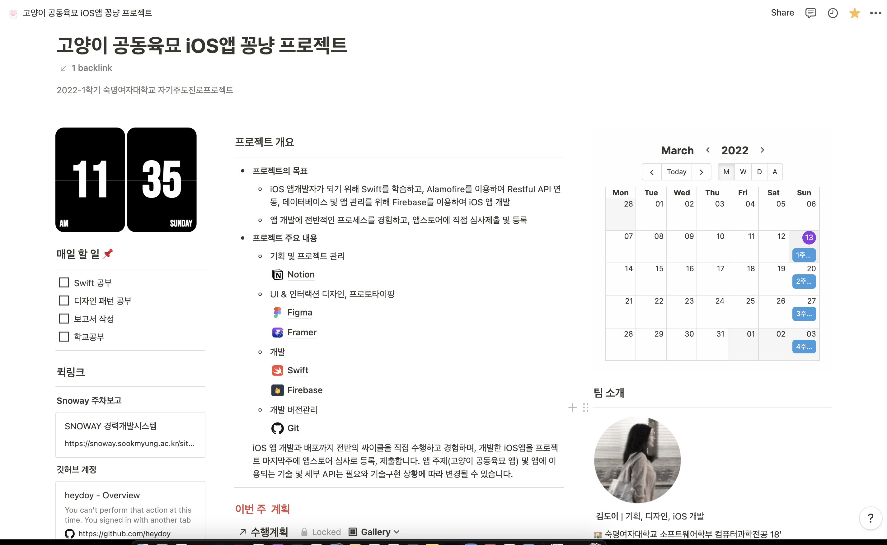



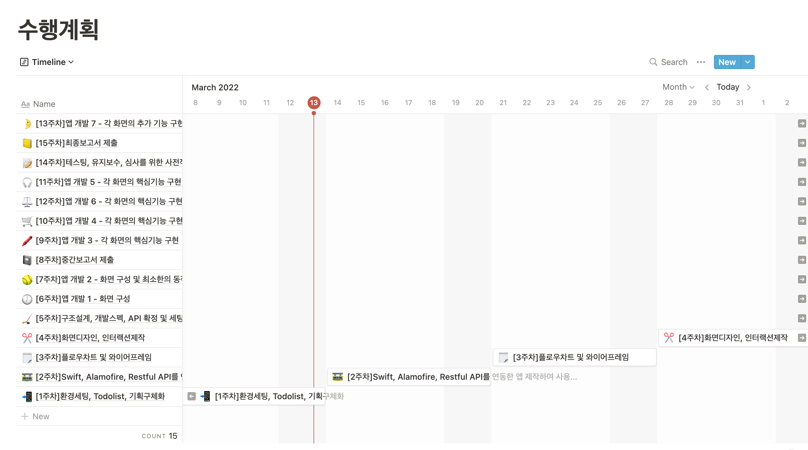

혹시 궁금하시다면 [여기](https://www.notion.so/kimdee/iOS-2977c7cc689e45cfa391c9d92b7b2e57)에서 제가 만든 노션 대시보드를 구경하실 수 있어요!

**2) 플로우차트** 

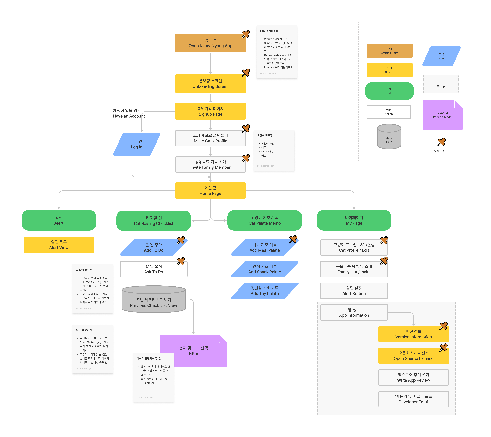

**3) 와이어프레임**

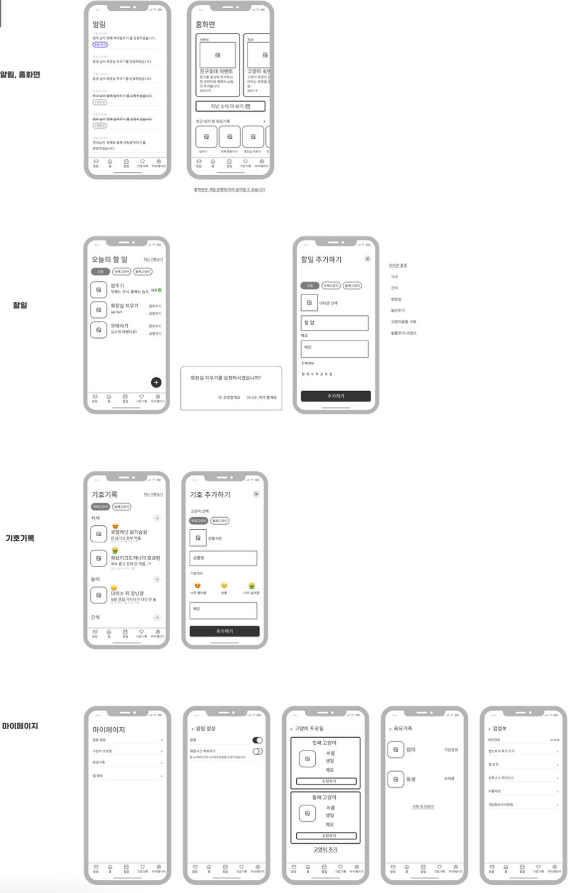

### \[3-5주차] 애플뮤직 클론앱으로 iOS 개발공부/ 꽁냥 앱 디자인

#### 클론앱

**\- 애플뮤직 클론앱** 

`AVFoundation` 을 이용하여 음악 아이템을 불러와서 재생, 멈춤 , 콜렉션뷰의 헤더 커스텀 디자인 

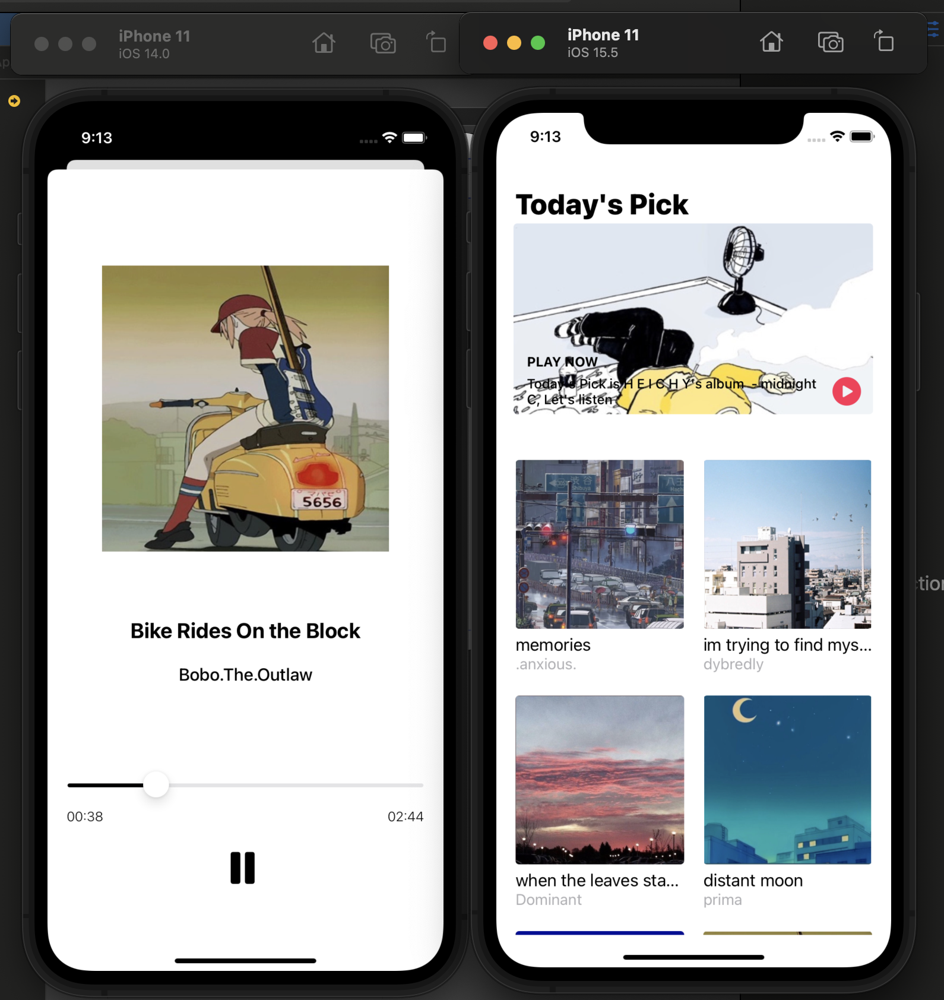

#### 디자인

**\- Figma로 UI 디자인** 

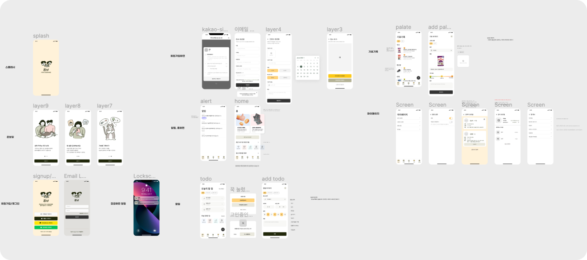

**\- Framer로 인터랙션 디자인** 

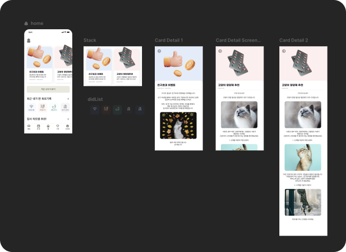

### \[6주차-15주차] 꽁냥 앱 개발

**Firebase 연동하여 데이터 관리** 

할 일, 알림, 집사가족 정보를 Firebase 를 통해 관리했습니다. 

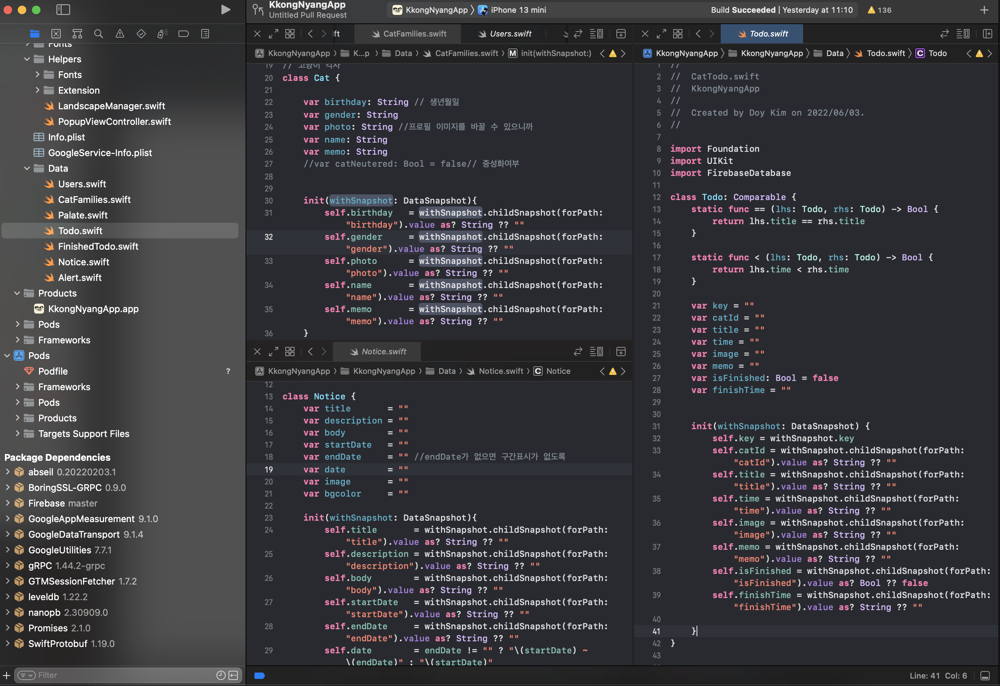

리얼타임 데이터베이스의 데이터를 스냅샷으로 가져와 저장하는 클래스를 선언하여 로컬에서 관리하였습니다. 

**데이터를 가져와서 콜렉션 뷰의 셀에 넣어 보여주게 구성** 

configure() 메서드를 통해 셀을 구성. Todo 클래스는 Firebase 리얼타임데이터베이스에서 스냅샷을 생성자에서 받아와서 데이터를 저장하는 클래스 

```
class TodoListCollectionViewCell: UICollectionViewCell {
    // MARK: - Properties
    var catId: String = ""
    
    @IBOutlet weak var iconImage: UIImageView!
    @IBOutlet weak var todoTitleLabel: UILabel!
    @IBOutlet weak var timeLabel: UILabel!
    @IBOutlet weak var checkButton: UIButton!
    @IBOutlet weak var finishedStamp: UIImageView!
    
    
    // MARK: - Actions
    
    func configure(_ todo: Todo) {
        // 데이터를 불러와서 셀을 구성
        catId = todo.catId
        iconImage.image = UIImage(named: todo.image)
        todoTitleLabel.text = todo.title
        timeLabel.text = todo.time
        
        if todo.isFinished == true {
            finishedStamp.alpha = 1
            
        } else {
            finishedStamp.alpha = 0
        }
    }

}
```

**액션시트로 할 일 수정 , 가족에게 요청, 할 일 완료 만들기**

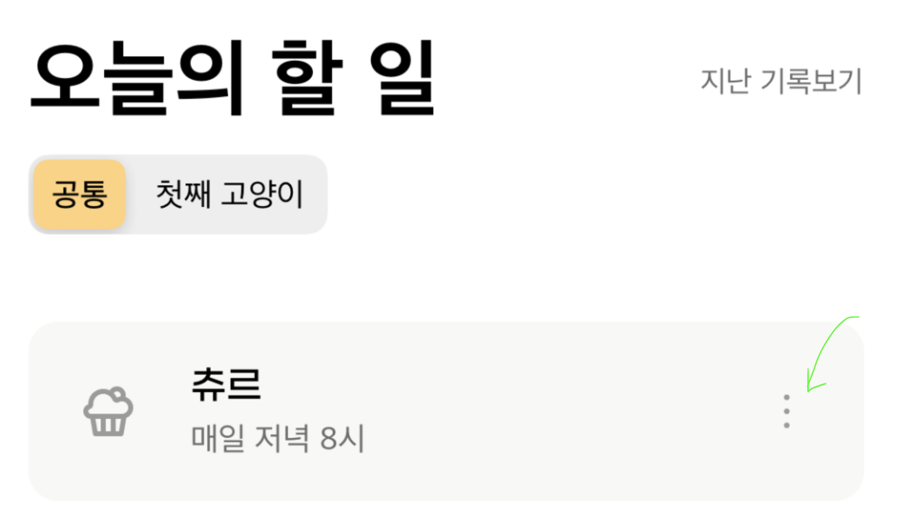

할 일 셀에서 점 3개 버튼을 눌러서 할 일로 해야될 일을 처리하는 액션시트를 띄워 할 일을 관리하게 했습니다. 

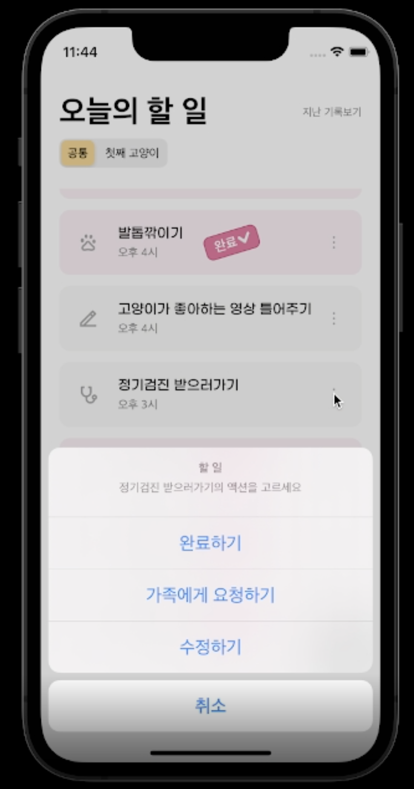

* 액션시트 선언 

```
let cell = catTodoList[sender.tag]
        
let actionSheet = UIAlertController(title: "할 일", message: "\(cell.title)의 액션을 고르세요", preferredStyle: .actionSheet)
        
var finishText = ""
if cell.isFinished == true {
    finishText = "완료 취소하기"
} else {
    finishText = "완료하기"
}
```

* 할일을 완료, 완료 취소하는 액션

```
let finish = UIAlertAction(title: finishText, style: .default) { _ in

            
    cell.isFinished = !cell.isFinished


    if cell.isFinished == true {


        let alertParent = self.db.child("alert/\(self.familyCode)")

        let alertPost = [
            "time" : Date().toString(),
            "finishedFrom" : self.userName,
            "todo" : cell.title,
            "todoKey" : cell.key,
            "isFinished" : true,

        ] as [String:Any]

        alertParent.childByAutoId().updateChildValues(alertPost)

        // 파이어베이스에 투두 isFinished 업데이트
        print(cell.key)
        let todoParent = self.db.child("catFamilies/\(self.familyCode)/todo/\(cell.key)")


        let todoPost = [
                    "isFinished": true,
                    "finishTime": Date().toString()
        ] as [String : Any]

        todoParent.updateChildValues(todoPost)


        self.showToast(message: "\(cell.title) \n완료하였습니다.")

    } else {
        // 완료취소인경우 완수타임 비우기
        cell.finishTime = ""

        // 파이어베이스에 투두 isFinished 업데이트
        let todoParent = self.db.child("catFamilies/\(self.familyCode)/todo/\(cell.key)")


        let todoPost = [
                    "isFinished": false,
                    "finishTime": ""
        ] as [String : Any]

        todoParent.updateChildValues(todoPost)

        self.showToast(message: "\(cell.title) \n완료 취소하였습니다.")
    }
    self.collectionView.reloadData()

}
```

* 가족에게 할 일을 요청하는 액션

```
let askFamily = UIAlertAction(title: "가족에게 요청하기", style: .default) { _ in
    // 가족에게 메시지 보내기
    let parent = self.db.child("alert/\(self.familyCode)")

    let post = [
        "time" : Date().toString(),
        "askedFrom" : self.userName,
        "todo" : cell.title,
        "todoKey" : cell.key,
        "isFinished" : false,
        "isAsked": true
    ] as [String:Any]

    parent.childByAutoId().updateChildValues(post)

    self.showToast(message: "가족에게 \(cell.title) \n요청하셨습니다.")
}
```

* 셀 내용을 수정하는 액션

```
let editTodo = UIAlertAction(title: "수정하기", style: .default) { _ in
    // edit 창 보여주기
    let storyboard = UIStoryboard(name: "Main", bundle: nil)

    let addTodoViewController = storyboard.instantiateViewController(withIdentifier: "AddTodoVC") as! AddTodoViewController

    addTodoViewController.familyCode = self.familyCode
    addTodoViewController.isEditing = true
    addTodoViewController.catID = cell.catId
    addTodoViewController.todo = cell.title
    addTodoViewController.time = cell.time
    addTodoViewController.image = cell.image
    addTodoViewController.memo = cell.memo

    addTodoViewController.modalPresentationStyle = .fullScreen
    self.present(addTodoViewController, animated: true, completion: nil)

} 
```