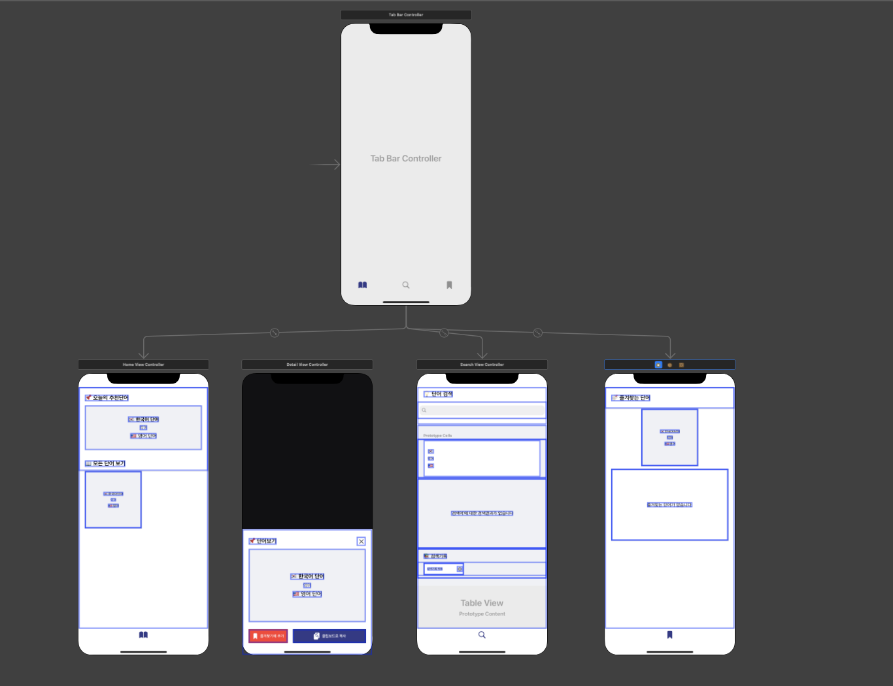
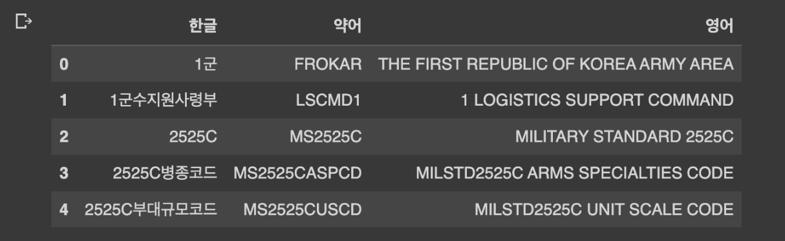
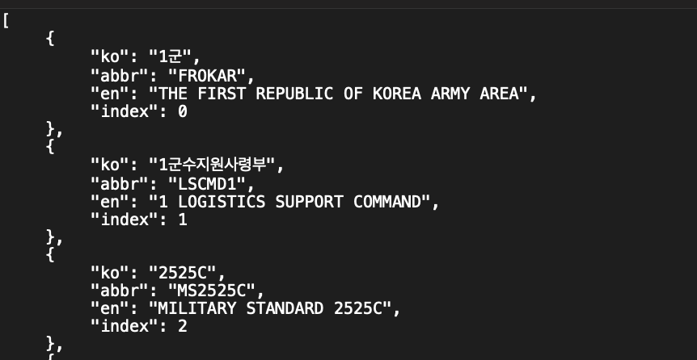
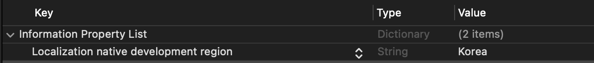
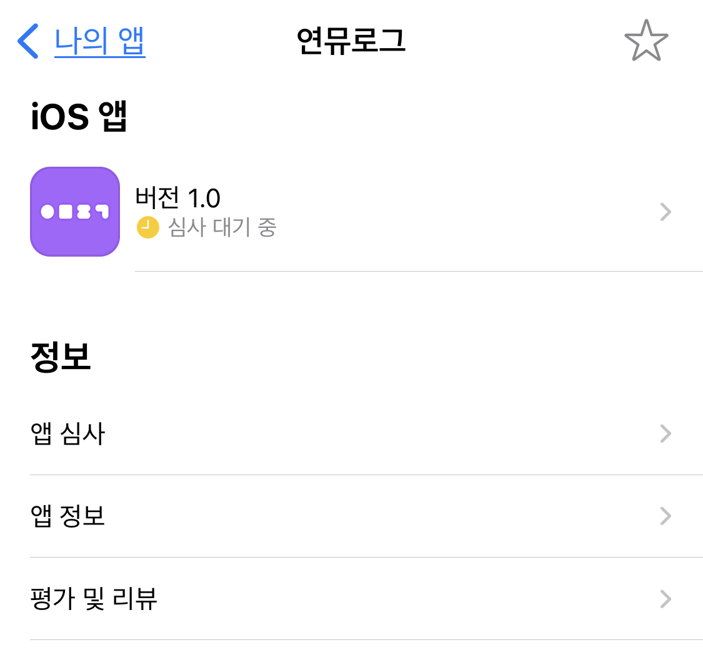

[한미연합사전 다운로드 링크](https://apps.apple.com/kr/app/%ED%95%9C%EB%AF%B8%EC%97%B0%ED%95%A9%EC%82%AC%EC%A0%84/id1640992615)

# 시작하며

한미연합사전은 [2022 국방데이터 활용 공모전](https://public-data.maicon.kr/)에 신청하기 위해 시작한 프로젝트였다. 군사용어와 약어, 한/영 버전을 확인할 수 있는 간단한 기능의 앱으로, 현직에서 통역장교로 일하는 기획자와 함께 둘이서 작업한 프로젝트이다. 

# 앱 기능 소개

오늘의 단어 (랜덤) / 모든 단어 보기 /  검색하기 / 즐겨찾기 /  단어를 클립보드에 복사



# 어려웠던 점

## 1. 데이터 수집 및 전처리

국방부에 있는 군사용어와 단어 자료를 가져와서 단어를 합쳤다. 기획자분이 수고를 해주셨는데, 어떤 자료는 뜻이 상세하게 있지만 어떤 데이터는 한, 영 단어만 제공하는 경우도 있었고, 아주 간단한 영어단어(예를 들어 숫자 1이라든지)들도 있어서 이 부분을 어떤 기준을 가지고 정리하느냐가 관건이었다. 

처음 앱을 기획하였을 당시 실무자들이 군사용어의 한/영 단어를 바로 검색하는 데 불편함이 있다는 점에서 착안했기 때문에, 간단하게 한국어, 약어, 영어 3가지를 기준으로 데이터를 가공하였다. 

[](https://www.data.go.kr/data/15089127/fileData.do)

[국방부_군사 용어 정보](https://www.data.go.kr/data/3081231/openapi.do)

[국방부_국방데이터 표준단어 목록_20220504](https://www.data.go.kr/data/15055578/fileData.do)

제공되는 자료가 CSV이다보니, 기획자 주도로 일일히 엑셀로 데이터를 가공하고 눈으로 검증하는 등 시간을 가졌는데 이제부터가 큰 고난의 시작이었다… 😇

## 2. CSV를 JSON으로 만들기

사실상 가장 많은 시간을 쏟은 부분이었다. CSV 파일 자체를 Xcode에서 읽어와서 처리할 수 있는 라이브러리가 없었다. 뭔가 이것저것(라이브러리 링크)을 써보았는데 영… 

그러다보니 그나마 자신있는 파이썬을 이용해 파일을 변환하는 과정을 거쳤는데 이를 통해서 또 색다른 문제들을 부딪치는 경험은 신비로웠지만 유쾌하지는 않았다. 20년도에 파이썬 수업 TA 를 했던 게 이렇게 돌아오다니, 배울 수 있을 때 열심히 배워야겠다는 생각이 들었다.

전처리를 하면서 가장 크게는 세가지 측면에서 고통을 받았다. 만약 이 다음에도 csv 확장자의 데이터를 사용해야한다면 꼭 이 부분을 염두에 두고 전처리를 해야되겠다는 생각을 가졌다. 

### \- 인코딩은 무조건 UTF-8 이 아니라  “euc-kr”

예전에도 인코딩의 세계에서 고통받았는데… 정부에서 제공하는 오픈 API 중에서 XML, CSV는 모두 euc-kr 로 인코딩을 하지 않으면 글자들이 모두 깨지게 된다. 

### \- 컬럼명을 반드시 영어로 하기

왜냐하면 저는 구조체의 프로퍼티 이름을 한글로 하지 않을 것이기 때문입니다. 

### \- 빈 값을 반드시 “” 빈 문자열로 채워주기

파이썬에서 데이터프레임으로 바꾼 후, JSON으로 바꾸면 널 값이 NaN값이 들어가는데, Xcode에서 인식할 수 있는 값이 아니기 때문에 이를 다 바꾸어주어야만 한다. 

### 전처리 순서

1. `pandas`와 `numpy` 라이브러리 import 

```python
import numpy as np
import pandas as pd
```

1. pandas의 `read_csv()` 메서드를 호출하여 파일을 읽어온다. 이 때 인코딩을 `euc-kr` 로 해주어야 한다. 

```python
df = pd.read_csv("data.csv", encoding="euc-kr")
```

1. 데이터프레임으로 바뀐 파일 형태 확인해보기

```python
df.head()
```



위와 같이 파일이 데이터프레임으로 잘 변환된 것을 볼 수 있다. 

1. 한글로 된 컬럼명을 영어로 된 컬럼으로 바꿔준다. json 형태로 바꾸면서 이 컬럼명이 구조체의 프로퍼티명이 되기 때문에 영어로 바꿔준다. 프로퍼티명을 한국어로 쓰고 싶지 않으므로…. 

```python
df.columns = ['ko', 'abbr', 'en']
```

1. 빈 값을 빈 문자열로 바꿔준다. 진짜..중요… 

```python
df.fillna('', inplace=True)
```

1. 인덱스 값을 컬럼으로 추가해준다. 나중에 이 인덱스를 데이터의 주요키로 사용하기 위해서 넣어주는 것!

```python
df['index'] = df.index
```

1. 데이터프레임을 JSON으로 용이하게 바꿔주기 위해 딕셔너리 형태로  바꿔준다. 

```python
dic = df.to_dict('records')
```

1. 딕셔너리로 바꾼 자료를 json 으로 내보내기한다. 

```python
import json

with open("./filename.json", 'w', encoding='utf-8') as file : 
	json.dump(dic, file, indent='\t', ensure_ascii=False)
```

이런 모양새가 되었다. 



가져온 JSON파일은 SwiftyJSON 라이브러리를 이용해서, 저장한 Json 파일 위치를 찾아서, JSON을 디코딩하여  구조체 배열 형태로 반환하는 클래스를 만들었다. 

```swift
import SwiftyJSON

class ArmyJargonManager {
    
    private init() {}
    
    static let shared = ArmyJargonManager()
    
    func getStruct() -> [ArmyJargon] {
        var list: [ArmyJargon] = []
        let fileNm: String = "armyvoca"
        // 2. 불러올 파일의 확장자명
        let extensionType = "json"
        
        // 3. 파일 위치
        guard let fileLocation = Bundle.main.url(forResource: fileNm, withExtension: extensionType) else { return list }
        
        
        do {
            // 4. 해당 위치의 파일을 Data로 초기화하기
            let data = try Data(contentsOf: fileLocation)
            let decodedSentences = try JSONDecoder().decode([ArmyJargon].self, from: data)
            list = decodedSentences
            return list
            
            
        } catch {
            // 5. 잘못된 위치나 불가능한 파일 처리 (오늘은 따로 안하기)
            return list
        }
    }
    

    
    
    
}
```

## 처음 써본 클립보드에 복사하기

클립보드에 복사하는 게 생각보다 쉬웠다. UIPasteboard에 문자열을 바로 대입하면 되는 것. 

```swift
UIPasteboard.general.string =
        """
        🇰🇷 한국어 : \(voca.ko)\n
        ▷ 약어 : \(voca.abbr)\n
        🇺🇸 영어 : \(voca.en)
        """
```

- - -

# 아쉬웠던 점

아무래도 공공데이터 외에 내부 용어자료집도 이용하여 확장하고 싶다는 생각이 크고, 공부하는 중간이라서 스토리보드 기반으로 만든 게 제일 아쉬운 부분이었다. 

# 앞으로 개선할 부분

*  개발언어 > 한국어로 바꾸기



*  처음 앱 구동할 때 JSON파일을 Realm으로 저장해서 관리하기
*  코드 베이스로 바꾸기
*  다국어 지원(영어) 및 리전 확대(미국, 영국 등 유럽) - 한국만 했더니 미군들이 다운받을 수 없대서..ㅠ
*  다국어 선택하게 만들기
*  검색어 히스토리를 최신순이 앞으로 가게

- - -

트러블슈팅 

*  검색어 히스토리 지울 때 빨리 지우면 앱이 크래시난다 (아마 out of index 에러..)

# 개발 시 참고한 자료

개인정보처리방침은 아래 링크와 같은 방식을 참고해도 좋을 것 같은데 막상 이렇게 하진 못하고, 개인정보처리방침을 만들어주는 개인정보보호포털을 이용하여 기획자분이 만들어주었다. 

이분도 사전앱을 많이 만드신 분인데, 이분과 마찬가지로 개인정보를 전혀 수집하고 있지 않기 때문에 앞으로 개인정보를 수집하지 않는 앱들을 만들 때 이분처럼 하나로 만들면 관리하기 편하지 않을까 싶다. 

[Privacy Policy](https://evolly.app/privacy-policy/)

# 마치며

 미군 측 Lieutenant 께 전달받은 내용..! 너무 기뻤다.


아직 공부할 것도 많고, 시작하는 단계이지만 이런 칭찬 한 마디 한마디가 큰 힘과 원동력이 되어주는 걸 느낄 수 있었다. 지금 참여하고 있는 새싹 iOS 과정 2기에서 출시 프로젝트를 하면서, 자괴감도 많이 들고 마음먹은 대로 되지 않은 것에 크게 고통 받았었는데 이 말 하나로 좀 더 힘을 낼 수 있었다. 

- - -



같이 부트캠프를 하고 있는 사람들 중에 제일 마지막 순번이 아닐까 싶은, 앱 심사신청을 어찌어찌 하게 되었다. 지금은 새벽 4시. 

- 

이제 심사신청이 끝났으니, 업데이트 버전을 작업하면서 회고 포스팅을 곧..빨리.. 일단은 지금 자고 내일 중으로 올리겠습니다.