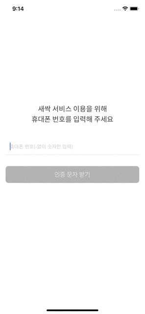

# 작업방법 How to

이전에 만든 테클 앱 프로젝트에서 인증시간을 체크하는 걸 만들었지만, 이번에는 RxSwift를 쓰고 있으므로 Rx의 타이머를 이용해 인증번호 유효시간을 알려주는 타이머를 만들고 싶었다. 앱이 백그라운드로 가더라도 유효시간이 바뀌지 않으므로 시간이 흘러야 했다. 

파이어베이스의 인증번호 입력시간이 20초로 매우 짧으므로, 디자인에서는 05:00 으로 되어 있지만 00:20 으로 만들었다. 

로직 자체는 아래와 같다. 

Although I made a timer for the verification code in the previous project Techl, this time I wanted to tweak it a little with Rx since I am using RxSwift for this project. And the timer mustn’t stop even if the app goes background because the Firebase never waits for us.

Since the Firebase verification code expires in just 20 seconds, I made a timer label to 00:20. 

The timer implemented with Rx is as follows.

```swift
let startTime = Date()
      
let timer = Observable<Int>
  .interval(
  .seconds(1), scheduler: MainScheduler.instance)
  .withUnretained(self)
  .subscribe { (vc, countValue) in
      let elapseSeconds = Date().timeIntervalSince(startTime)
      let remainedTime = vc.limitTime - Int(elapseSeconds)
      let remainedTimeString = remainedTime >= 10 ? "\(remainedTime)" : "0\(remainedTime)"
      vc.mainView.timerLabel.text = "00:\(remainedTimeString)"
}

DispatchQueue.main.asyncAfter(deadline: .now() + 20) { [weak self] in
        timer.dispose()
        self?.mainView.resendButton.isEnabled = true
        let buttonColor = FillButton()
        self?.mainView.resendButton.backgroundColor = buttonColor.backgroundColor
        self?.mainView.resendButton.setTitleColor(buttonColor.titleColor, for: .normal)
        self?.mainView.resendButton.layer.borderColor = buttonColor.borderColor
        self?.mainView.timerLabel.isHidden = true
    }
}
```

시작시간을 현재 시간 기준으로 잡고, 메인스케줄러에서 1초 간격으로 카운트를 해주었다. 

구독을 한 후 현재 시간 기준으로 시작시간으로부터 얼마나 시간이 지났는지 체크하는 변수 `elapseSeconds`를 만들어주고, 제한시간을 선언해둔 상수로부터 시간을 빼서 타이머 레이블로 보여주었다. 이때 20초가 지나면 타이머가 작동하지 않아야하므로 dispatchqueue를 이용하여 타이머를 dispose 해주고 재전송 버튼을 활성화하고 그에 따른 디자인을 변경해주고 타이머 레이블을 숨김처리 해주었다. 

`startTime` is set as the current time, and the `MainScheduler` counted it every second.

In the `subscribe` closure, created a variable `elapseSeconds` that checks how much time has elapsed from the `startTime` and, subtracts the time from the constant `timeLimit` that has declared above `viewDidLoad()` and saves it to `remainedTime`. Note that the timer shouldn’t work after 20 seconds have passed.  So I disposed of the timer using `DispatchQueue`, activate the resend button, and hide the timer label.


# 화면 Screenshot

